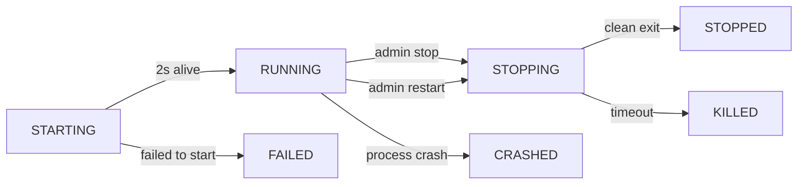

# Phase 10: User Guide - WebHostLib Integration

**SekaiLink - Archipelago Multiworld Hosting Platform**

This guide covers all features added in Phase 10: WebHostLib Integration, including the YAML Creator, lobby generation system, and server management.

---

## Table of Contents

1. [YAML Creator](#yaml-creator)
2. [Creating and Joining Lobbies](#creating-and-joining-lobbies)
3. [Generation System](#generation-system)
4. [Server Management (Admin)](#server-management-admin)
5. [Troubleshooting](#troubleshooting)

---

## YAML Creator

### What is the YAML Creator?

The YAML Creator is a dynamic form-based tool that lets you create Archipelago YAML configuration files without writing any code. It automatically generates forms for **ALL 100+ Archipelago games** based on each game's option definitions.

### How to Use

#### 1. **Access the YAML Creator**

From any game page:
- Click the **"Create YAML"** button next to the game's boxart
- URL format: `/games/<game-slug>/create-yaml`

Example: For "A Link to the Past", visit `/games/a-link-to-the-past/create-yaml`

#### 2. **Fill Out the Form**

The form will automatically load with all available options for that game:

**Common Option Types:**

- **Toggle** (On/Off checkboxes)
  - Example: "Enable Hard Mode" → Check to enable

- **Choice** (Dropdown menus)
  - Example: "Logic Difficulty" → Select from: Easy, Normal, Hard, Expert

- **Range** (Number sliders or inputs)
  - Example: "Starting Hearts" → Slider from 3 to 20

- **Named Range** (Slider with named values)
  - Example: "Difficulty" → Beginner (0), Intermediate (50), Expert (100)

- **Free Text** (Text input)
  - Example: "Player Name" → Type your name

- **Text Choice** (Dropdown with custom text values)
  - Example: "Starting Location" → Choose from preset locations

- **Option List** (Checkboxes for multiple selections)
  - Example: "Starting Items" → Check all items you want to start with

- **Option Counter** (Quantity inputs)
  - Example: "Item Pool" → Set quantity for each item type

**Form Structure:**
```
Game Name: A Link to the Past
Description: Randomizer for The Legend of Zelda: A Link to the Past

┌─────────────────────────────────────────┐
│ Game Settings                           │
├─────────────────────────────────────────┤
│ Logic Difficulty:  [Dropdown ▼]        │
│ Goal:              [Dropdown ▼]        │
│ Sword Location:    [Dropdown ▼]        │
│ Starting Hearts:   [──●────────] 10    │
│ Enable Keysanity:  ☑                   │
│ ...                                     │
└─────────────────────────────────────────┘

[Download YAML]  [Save to Vault]
```

#### 3. **Save Your YAML**

**Option A: Download YAML**
- Click **"Download YAML"** button
- File will be saved as `<game-name>.yaml` to your downloads folder
- You can upload this later when creating a lobby

**Option B: Save to Vault**
- Click **"Save to Vault"** button
- YAML is saved to your account's YAML Vault
- Accessible from Dashboard → YAML Manager
- Can be used directly when creating lobbies (no re-upload needed)

#### 4. **Edit Existing YAMLs**

From Dashboard → YAML Manager:
- Click **"Edit"** next to any saved YAML
- Opens YAML Creator with pre-filled values
- Make changes and save again

---

### Supported Games

The YAML Creator supports **ALL** Archipelago games automatically, including:

**Popular Games:**
- A Link to the Past
- Super Metroid
- Ocarina of Time
- Hollow Knight
- Minecraft
- Factorio
- Timespinner
- Rogue Legacy
- ... and 90+ more!

**Custom Worlds:**
- Supported if installed on the server
- Warning: Custom worlds may be unstable
- Report issues to SekaiLink Discord (NOT Archipelago Discord)

---

### Advanced Features

#### **Presets** (Coming Soon)
- Load preset configurations
- Save your own presets
- Share presets with friends

#### **YAML Validation**
- Automatic validation using Archipelago's schema
- Detailed error messages if something is wrong
- Option-specific validation (ranges, valid choices, etc.)

#### **Smart Defaults**
- All options have sensible default values
- Based on Archipelago's recommendations
- Can be customized to your preference

---

## Creating and Joining Lobbies

### Creating a Lobby

#### 1. **Navigate to Game Page**
- Click on any game from the homepage
- Or visit `/games/<game-slug>`

#### 2. **Click "Create Lobby"**
- Fill out lobby settings:
  - **Lobby Name**: Unique name for your session
  - **Player Limit**: Max number of players (2-255)
  - **Time Limit**: 1h, 2h, 3h, 4h, or unlimited
  - **Rules**: Custom rules for your sync (text field)
  - **Allow Multiworld**: Players can play multiple games
  - **Disallow ROM Games**: Restrict games requiring ROMs
  - **Allow Broadcast**: Let players stream/broadcast
  - **Privacy**: Open, Private, or Closed

#### 3. **Lobby Created!**
- You're now the **Host**
- Copy the lobby URL to share with friends
- URL format: `/lobby.html?id=<lobby-id>`

### Joining a Lobby

#### From Game Page:
- Scroll to "Current Lobbies" section
- Click on any open lobby to join

#### From Homepage:
- Browse "Active Lobbies" list
- Click "Join" on any open lobby

#### Direct Link:
- Use the lobby URL shared by the host

---

### Lobby Workflow

#### **Step 1: Upload YAMLs**

**From YAML Vault:**
- Click "Select from Vault" dropdown
- Choose your saved YAML
- Click "Use This YAML"

**Upload File:**
- Click "Upload YAML"
- Select `.yaml` file from your computer
- File is validated automatically

**If ROM Required:**
- Upload ROM file as well
- SHA-1 hash verification ensures compatibility
- ROMs are stored temporarily (cleared monthly)

#### **Step 2: Mark Ready**

- Once YAML (and ROM if needed) are uploaded, click **"Ready"**
- Ready status appears next to your name in the player list
- Host can see who's ready

#### **Step 3: Host Generates Seed**

**When All Players Ready:**
- Host clicks **"Generate"** button
- Generation starts using WebHostLib
- Progress appears in chat:
  ```
  🎲 Generation started...
  ✅ Validating YAMLs...
  ✅ Rolling options...
  ✅ Generating multidata...
  ✅ Creating patches...
  🚀 Server starting on port 38281...
  ✅ Generation complete!
  ```

#### **Step 4: Connect to Server**

**Server Address:**
- Displayed in lobby: `sekailink.xyz:<port>`
- Example: `sekailink.xyz:38281`

**Download Patch (if applicable):**
- Click **"Download Patch"** next to your name
- File format: `.appatch` or `.apz3` (depending on game)
- Apply patch using Archipelago's ROM patcher

**Connect Archipelago Client:**
1. Open Archipelago client for your game
2. Enter server address: `sekailink.xyz:<port>`
3. Enter your slot name (must match YAML)
4. Click "Connect"

#### **Step 5: Play!**

- Timer starts when host clicks **"Start Sync"**
- Play your game, items sync in real-time
- Chat updates with major events (item finds, goal completion)
- Mark **"Finished"** when you complete your goal
- Or **"DNF/Forfeit"** if you give up

#### **Step 6: Finish**

- Host clicks **"Stop Sync"** when session ends
- Timer stops
- Server stays active for 30 minutes (for final item collection)
- Lobby moves to "Past Lobbies" list

---

## Generation System

### How It Works

SekaiLink uses **Archipelago's WebHostLib** for seed generation, the same proven system used by archipelago.gg's website hosting.

### Generation Process

```
1. Host clicks "Generate"
   ↓
2. Celery task starts (backend/tasks.py)
   ↓
3. YAML Validation (backend/generation_bridge.py)
   - Validates each player's YAML
   - Checks option schema
   - Ensures compatibility
   ↓
4. Option Rolling (WebHostLib/upload.py)
   - Processes each game's options
   - Resolves random settings
   - Creates world configurations
   ↓
5. Multidata Generation (WebHostLib/generate.py)
   - Runs Archipelago's core generation
   - Creates multidata.zip
   - Generates patches for ROM games
   ↓
6. Server Startup (backend/server_manager.py)
   - Starts Archipelago server in isolated process
   - Assigns port (38281-38380 range)
   - Health check confirms server running
   ↓
7. Lobby Status: READY ✅
   - Server address displayed
   - Patches available for download
   - Players can connect
```

### Generation States

| State | Description | What You See |
|-------|-------------|--------------|
| **Pending** | Waiting for all players to ready | "Waiting for players..." |
| **Generating** | Generation in progress | "🎲 Generating seed..." |
| **Ready** | Server running, ready to play | "✅ Server: sekailink.xyz:38281" |
| **Active** | Game in progress | "🎮 Timer: 01:23:45" |
| **Finished** | Game completed | "🏁 Finished" |
| **Failed** | Generation error | "❌ Error: <message>" |

### Error Handling

**Common Errors:**

- **"Invalid YAML syntax"**
  - Fix: Use YAML Creator to generate valid files
  - Or: Check YAML syntax with online validator

- **"Option X not valid for game Y"**
  - Fix: Ensure YAML was created for correct game
  - Or: Update YAML with correct option names

- **"ROM hash mismatch"**
  - Fix: Upload correct ROM version
  - Check Archipelago docs for required ROM version

- **"Server failed to start"**
  - Contact admin - server issue
  - Check server logs for details

---

## Server Management (Admin)

### Overview

Phase 10.3 added professional multiprocess server management with health monitoring and admin controls.

### Admin Endpoints

#### **1. List All Servers**

**GET** `/api/admin/servers`

**Response:**
```json
{
  "servers": [
    {
      "lobby_id": 123,
      "pid": 12345,
      "port": 38281,
      "status": "running",
      "started_at": "2026-01-04T10:00:00",
      "cpu_percent": 2.5,
      "memory_mb": 45.2,
      "uptime_seconds": 3600
    }
  ],
  "total": 1
}
```

**Use Case:** Monitor all active servers at a glance

---

#### **2. Get Server Details**

**GET** `/api/admin/servers/<lobby_id>`

**Response:**
```json
{
  "lobby_id": 123,
  "pid": 12345,
  "port": 38281,
  "status": "running",
  "started_at": "2026-01-04T10:00:00",
  "last_health_check": "2026-01-04T11:00:00",
  "multidata_path": "/tmp/generation/123/multidata.zip",
  "log_path": "/tmp/generation/123/logs/server.log",
  "cpu_percent": 2.5,
  "memory_mb": 45.2,
  "uptime_seconds": 3600
}
```

**Use Case:** Deep dive into specific server metrics

---

#### **3. Stop Server**

**POST** `/api/admin/servers/<lobby_id>/stop`

**Request:**
```json
{
  "graceful": true
}
```

**Response:**
```json
{
  "status": "success",
  "message": "Server stopped gracefully"
}
```

**Options:**
- `graceful: true` → Send SIGTERM, wait 10s, then SIGKILL if needed
- `graceful: false` → Immediate SIGKILL

**Use Case:** Emergency stop, or clean shutdown when lobby ends

---

#### **4. Restart Server**

**POST** `/api/admin/servers/<lobby_id>/restart`

**Response:**
```json
{
  "status": "success",
  "message": "Server restarted successfully",
  "server": {
    "pid": 12346,
    "port": 38281,
    "status": "starting"
  }
}
```

**Use Case:** Server crashed or became unresponsive

---

#### **5. Health Check**

**GET** `/api/admin/servers/<lobby_id>/health`

**Response:**
```json
{
  "lobby_id": 123,
  "status": "running",
  "healthy": true,
  "cpu_percent": 2.5,
  "memory_mb": 45.2,
  "uptime_seconds": 3600
}
```

**Use Case:** Quick health check for specific server

---

#### **6. View Logs**

**GET** `/api/admin/servers/<lobby_id>/logs?lines=50`

**Response:**
```json
{
  "lobby_id": 123,
  "lines": 50,
  "logs": "[2026-01-04 10:00:00]: Server started on port 38281\n[2026-01-04 10:00:05]: Player 'Alice' connected\n..."
}
```

**Use Case:** Debug server issues, check connection logs

---

### Server States



**State Descriptions:**

- **STARTING**: Server process launched, waiting for health confirmation (2s)
- **RUNNING**: Server confirmed alive, accepting connections
- **STOPPING**: Admin initiated shutdown, graceful termination in progress
- **STOPPED**: Server cleanly shut down (SIGTERM successful)
- **KILLED**: Server force-killed (SIGKILL used after timeout)
- **FAILED**: Server failed to start (invalid config, port conflict, etc.)
- **CRASHED**: Server process died unexpectedly

---

### Health Monitoring

**Metrics Tracked:**

1. **Process ID (PID)**: Unique identifier for server process
2. **Port**: Network port (38281-38380 range)
3. **Status**: Current state (see above)
4. **CPU %**: Percentage of CPU usage (0-100%)
5. **Memory (MB)**: RAM usage in megabytes
6. **Uptime**: Seconds since server started
7. **Last Health Check**: Timestamp of most recent health check

**How It Works:**

- Uses `psutil` Python library for metrics
- Health checks run on-demand via API
- Automatic crash detection (process.is_running() check)
- Metrics update every health check

**Admin Dashboard** (Future):
- Real-time server list with metrics
- One-click stop/restart buttons
- Log viewer UI
- Automatic refresh every 60s

---

### Multiprocess Isolation

**Key Feature: Crash Resistance**

Each server runs in a **fully isolated process**:

```python
subprocess.Popen(
    cmd,
    start_new_session=True,    # NEW SESSION (isolation)
    preexec_fn=os.setpgrp       # NEW PROCESS GROUP
)
```

**Benefits:**

1. **No Cascade Failures**: One server crash doesn't affect others
2. **API Independence**: API restart doesn't kill servers
3. **Clean Signal Handling**: Graceful shutdown with SIGTERM/SIGKILL
4. **Resource Tracking**: Each server's CPU/memory tracked independently

**Example Scenario:**

```
Server A (Lobby 1): A Link to the Past - RUNNING ✅
Server B (Lobby 2): Super Metroid     - RUNNING ✅
Server C (Lobby 3): Hollow Knight     - RUNNING ✅

❌ Server B crashes (port conflict)

Server A: Still RUNNING ✅
Server B: CRASHED ❌
Server C: Still RUNNING ✅

Admin: Restart Server B → RUNNING ✅
```

---

## Troubleshooting

### YAML Creator Issues

#### **"Form not loading"**

**Symptoms**: Blank page or "Loading..." never finishes

**Causes:**
- Game not installed on server
- Invalid game slug in URL

**Fix:**
1. Check game slug is correct (lowercase, hyphens for spaces)
2. Try different game to confirm server connectivity
3. Contact admin if specific game doesn't work

---

#### **"Options missing or incorrect"**

**Symptoms**: Expected option doesn't appear in form

**Causes:**
- Game's option definitions updated
- Custom world not installed

**Fix:**
1. For official games: Report to SekaiLink Discord
2. For custom worlds: Ensure custom world is installed on server
3. Check Archipelago docs for option name

---

### Lobby Issues

#### **"Can't join lobby - Private/Closed"**

**Symptoms**: "Lobby is private" or "Lobby is closed" error

**Causes:**
- Host set lobby to Private or Closed
- Lobby reached player limit

**Fix:**
1. Ask host to change privacy settings
2. Ask host to increase player limit
3. Join different lobby

---

#### **"Ready button disabled"**

**Symptoms**: Can't click "Ready" button

**Causes:**
- YAML not uploaded
- ROM required but not uploaded
- YAML validation failed

**Fix:**
1. Upload valid YAML file (or select from vault)
2. If ROM game, upload correct ROM
3. Check chat for validation error messages

---

### Generation Issues

#### **"Generation failed - Invalid YAML"**

**Symptoms**: Generation stops with YAML error in chat

**Causes:**
- Syntax error in YAML
- Invalid option value
- Wrong game specified in YAML

**Fix:**
1. Use YAML Creator (guarantees valid syntax)
2. Check `game:` field matches lobby game
3. Verify all option values are valid choices

**Example Error:**
```
❌ Error in player 'Alice' YAML:
Option 'sword_location' value 'uncle_house' is not valid.
Valid choices: randomized, uncle, pedestal, link_house
```

**Fix:** Update YAML with valid value from list

---

#### **"Generation failed - ROM hash mismatch"**

**Symptoms**: "ROM SHA-1 hash does not match expected" error

**Causes:**
- Wrong ROM version uploaded
- Corrupted ROM file
- Wrong game ROM (e.g., uploaded SMZ3 ROM for pure ALTTP)

**Fix:**
1. Check Archipelago docs for required ROM version
2. Re-dump ROM from cartridge/disc
3. Verify file integrity (SHA-1 checksum)

**Example:**
```
A Link to the Past (JP 1.0):
Expected SHA-1: 03a63945398191337e896e5771f77173d9a85d15
Your ROM SHA-1: 1234567890abcdef1234567890abcdef12345678
```

---

#### **"Server failed to start"**

**Symptoms**: Generation completes but server status shows "FAILED"

**Causes:**
- Port already in use (conflict)
- Invalid multidata.zip
- Server crash on startup
- Resource limits exceeded

**Fix:**
1. Contact admin (server-side issue)
2. Admin checks `/api/admin/servers/<lobby_id>/logs`
3. Admin restarts server via `/api/admin/servers/<lobby_id>/restart`

**Admin Debug:**
```bash
# Check logs
GET /api/admin/servers/123/logs?lines=100

# Look for errors:
[ERROR] Port 38281 already in use
[ERROR] Failed to load multidata: Invalid format
[ERROR] Memory allocation failed
```

---

### Connection Issues

#### **"Can't connect to server"**

**Symptoms**: Archipelago client shows "Connection failed" or "Timeout"

**Causes:**
- Server not running (check lobby page status)
- Wrong server address
- Firewall blocking connection
- Slot name mismatch

**Fix:**
1. Verify server status: Should show "🟢 Running"
2. Copy server address exactly: `sekailink.xyz:<port>`
3. Check slot name matches YAML exactly (case-sensitive!)
4. Try different network (VPN, mobile hotspot)

**Example:**
```
YAML:
  name: AliceInWonderland

Client Slot Name: AliceInWonderland  ✅ Correct
Client Slot Name: aliceinwonderland  ❌ Wrong (case)
Client Slot Name: Alice               ❌ Wrong (incomplete)
```

---

#### **"Connection drops during gameplay"**

**Symptoms**: Client disconnects mid-game

**Causes:**
- Network instability
- Server crash
- Server restart

**Fix:**
1. Check server status in lobby page
2. Reconnect with same slot name (progress saved)
3. If server crashed, contact admin for restart
4. Admin checks health: `GET /api/admin/servers/<lobby_id>/health`

---

### Server Management Issues (Admin)

#### **"Health check shows CRASHED but server still running"**

**Symptoms**: Status says CRASHED but server process exists

**Causes:**
- PID mismatch (server restarted outside ServerManager)
- Stale PID in database

**Fix:**
```bash
# Admin: Stop stale server
POST /api/admin/servers/<lobby_id>/stop
{"graceful": false}  # Force kill

# Host: Generate again (creates fresh server)
```

---

#### **"Can't stop server - Graceful shutdown timeout"**

**Symptoms**: Graceful stop fails, server still running

**Causes:**
- Server stuck in infinite loop
- Process not responding to SIGTERM

**Fix:**
```bash
# Admin: Force kill
POST /api/admin/servers/<lobby_id>/stop
{"graceful": false}

# Or restart (stop + start)
POST /api/admin/servers/<lobby_id>/restart
```

---

## Getting Help

### User Support

**SekaiLink Discord**: https://discord.gg/XvvcBxrRsk
- `#support` - General help
- `#bug-reports` - Report issues
- `#feature-requests` - Suggest improvements

**IMPORTANT:** Archipelago.gg does NOT provide support for SekaiLink issues. Only report SekaiLink-specific problems to our Discord.

### Bug Reports

When reporting bugs, include:

1. **What you were trying to do**
2. **What happened instead**
3. **Steps to reproduce**
4. **Browser/client version**
5. **Lobby ID** (if applicable)
6. **Screenshots** (if visual issue)

**Example:**
```
Issue: YAML Creator not loading for Hollow Knight

Steps:
1. Go to /games/hollow-knight
2. Click "Create YAML"
3. Page loads but form is blank

Browser: Chrome 120
Screenshot: [attached]
```

### Feature Requests

Format:
```
Feature: [Short title]
Description: [What you want]
Use Case: [Why it's useful]
Priority: Low / Medium / High
```

---

## Credits

**SekaiLink Team:**
- Jade (@lovenityjade) - Lead Developer

**Powered By:**
- Archipelago.gg - Core generation system, WebHostLib integration
- Archipelago Community - Game worlds and apworlds

**Infrastructure:**
- Hostinger - VPS hosting
- Docker - Containerization
- PostgreSQL - Database
- Redis - Task queue
- Celery - Background tasks

---

## Contact

**Email**: sekailink@themiareproject.com
**Discord**: https://discord.gg/XvvcBxrRsk
**GitHub**: https://github.com/lovenityjade/sekailink

---

**End of User Guide**

*Last Updated: January 4, 2026 (Phase 10 Complete)*
