# SekaiLink Full Repository Audit

Date: 2026-06-27  
Audited from: `/home/thelovenityjade`  
Primary canonical repo: `/home/thelovenityjade/SekaiLink/canonical`  
Directive: documentation only. No code movement, no deletion, no deploy, no cleanup-by-force.

## Executive Summary

SekaiLink is not one repository anymore in practice. It is a live ecosystem made of:

- one canonical monorepo;
- one legacy quarantine tree;
- one pre-E2E quarantine archive containing older monorepos, upstream references, and build artifacts;
- local reference repositories for Archipelago, PopTracker, SNI, Harkipellago, Dusk/Twilight Princess, and other research;
- runtime resources inside the canonical repo;
- local user/runtime state under `.config`, `.cache`, `.local/state`;
- Windows/GDrive backup copies;
- server mount points that look like operational surfaces but must not be treated as canonical source.

The immediate risk is not that work is missing. The risk is source confusion: multiple repos contain files with the same names and purposes, especially Link/Nexus/Worlds server code, PopTracker code, Archipelago/MultiworldGG trees, and old Sekaiemu/SKLMI experiments.

The safe source of truth for active SekaiLink work remains:

```text
/home/thelovenityjade/SekaiLink/canonical
```

Everything else is either reference, quarantine, archive, local runtime state, test lab, or external upstream.

## Repo Relationship Map

```mermaid
flowchart TD
    Canonical[sekailink-canonical\nactive working monorepo]

    Client[apps/client-core\nElectron UI + launcher + runtime orchestration]
    Sekaiemu[apps/sekaiemu\nlibretro emulator shell + ImGui debug/runtime UI]
    SKLMI[services/sklmi\nruntime bridge/service layer]
    Link[services/link-social/link-room\nlobbies, chat, room orchestration]
    Nexus[services/nexus\nidentity, configs, account data]
    Worlds[services/worlds + runtime/ap\nAP generation + APWorld/client runtime]
    PopRuntime[runtime/poptracker + third_party/upstream/poptracker-sekailink\nPopTracker - Sekailink Edition]
    APWrappers[runtime/ap + runtime/*wrapper.py\nArchipelago clients wrapped headless]
    Modules[runtime/modules + runtime/game-registry\nper-game launch manifests]

    Canonical --> Client
    Canonical --> Sekaiemu
    Canonical --> SKLMI
    Canonical --> Link
    Canonical --> Nexus
    Canonical --> Worlds
    Canonical --> PopRuntime
    Canonical --> APWrappers
    Canonical --> Modules

    RefAP[Projects/reference-repos/Archipelago\nclean upstream reference]
    RefPop[Projects/reference-repos/PopTracker\nclean upstream reference]
    RefSNI[Projects/reference-repos/sni\nclean upstream SNI reference]
    BHC[third_party/bhc-substitutes\nLua connector substitutes]
    APSoE[third_party/upstream/ap-soeclient\nSoE/SoM browser AP client research]
    Quarantine[_sekailink_quarantine\nold full workspace/archive]
    Legacy[sekailink-legacy-quarantine-2026-05-17\nolder split repos]
    Labs[SekaiLink-Labs\nPopTracker ImGui lab]

    RefAP -.reference.-> Worlds
    RefPop -.reference.-> PopRuntime
    RefSNI -.reference.-> APWrappers
    BHC -.adapter research.-> APWrappers
    APSoE -.web client runtime.-> APWrappers
    Quarantine -.historical source only.-> Canonical
    Legacy -.historical source only.-> Canonical
    Labs -.prototype only.-> PopRuntime
```



## Canonical Git State

| Field | Value |
|---|---|
| Path | `/home/thelovenityjade/SekaiLink/canonical` |
| Branch | `main` |
| HEAD | `d4517bc` |
| HEAD date | 2026-06-19 19:00:13 -0400 |
| HEAD subject | `Document SekaiLink recovery state` |
| Remotes | `origin=https://github.com/lovenityjade/sekailink-canonical.git`, `windows-build=ssh://sekailink@sekailink-windows/d/SekaiLink/git/sekailink-canonical.git`, `legacy-disabled=https://github.com/lovenityjade/sekailink.git` |
| Dirty entries | 410 |
| Modified tracked files | 196 |
| Deleted tracked files | 2 |
| Untracked entries | 212 |
| Diff stat | 198 files changed, 17,696 insertions, 17,795 deletions |
| Approx size | 28G |

### Current Dirty Worktree Meaning

| Area | Meaning | Risk |
|---|---|---|
| `apps/client-core/electron/main.cjs` | Refactor from a monolithic 8k+ line Electron main into `electron/lib/*` modules. | High. New files are untracked, so losing them breaks the refactor. |
| `apps/client-core/src/redesign/*` | BETA-3 redesigned UI, lobbies, settings, game launch, chat, notifications, selection modals. | High. Product-facing and heavily modified. |
| `apps/sekaiemu/src/*` | ImGui menu/debug/activity/chat/runtime memory bridge work. | High. Runtime-facing and under active stabilization. |
| `runtime/ap/*` | Bundled Archipelago/MultiworldGG runtime, APWorlds, modified clients, wrappers. | High. This is where compatibility can silently drift. |
| `runtime/modules/*` | Game manifests used by Client Core launch and runtime selection. | High. Determines what games are visible/launchable. |
| `runtime/poptracker/*` | Bundled PopTracker runtime and packs. | Medium-high. Required for BETA-3 tracker path. |
| `services/link-social`, `services/link-room` | Chat/lobby/generation handoff server code and snapshots. | Critical. Live source-of-truth is not fully reconciled. |
| `services/nexus` | Identity and seed config service code. | Critical. User/config data path. |
| `services/worlds` | Generation service integration. | Critical. Affects all seed generation. |
| `tools/room-admin-tui` | Admin/debug TUI for rooms, AP commands, reports. | Medium. Useful for testing, not player-facing. |
| `docs/*` | Recovery, compatibility, runtime directives, live maps. | Critical for orientation. |

## Active Subsystems

### Client Core

| Path | Status | Purpose | Notes |
|---|---|---|---|
| `apps/client-core/` | Active, dirty | Electron app, login, dashboard, lobbies, library, settings, launch UX. | Product-facing BETA-3 shell. |
| `apps/client-core/electron/main.cjs` | Refactored but dirty | Main Electron entrypoint. | Reduced from very large file to 864 lines, but depends on untracked `electron/lib/*`. |
| `apps/client-core/electron/lib/*` | Active, mostly untracked | Runtime launch modules: Sekaiemu, PopTracker, Archipelago clients, patching, Python, updates, windowing. | Must be staged/reviewed as one refactor set. |
| `apps/client-core/src/redesign/App.tsx` | Active, dirty | Main redesigned UI shell. | 1510 lines. Still large enough to split later. |
| `apps/client-core/src/redesign/components/LobbyRoomPage.tsx` | Active, dirty | Lobby room, generation, launch, game selection. | 2050 lines. Recent `InvalidSlot` fixes live near launch context integration. |
| `apps/client-core/src/services/lobbyLaunchContext.ts` | Active, dirty | Resolves account/user identity to AP slot launch context. | Important invariant: AP `slotName` must never be replaced by human account name. |
| `apps/client-core/src/services/roomSessionLaunch.ts` | Active, dirty | Launch validation and runtime session start. | Recently touched for room/player validation. |
| `apps/client-core/src/__tests__/liveLaunchContext.test.ts` | Active, dirty | Regression tests for launch context and slot/account separation. | Passed recently before this audit. |

Feature status:

| Feature | Status | Comment |
|---|---|---|
| Login/session | Functional but needs regression pass | 30-day persistence was requested earlier; verify current implementation. |
| Dashboard/lobbies/library | Functional enough for tests | UI still has known loading/error polish work. |
| Advanced configs from Nexus schemas | Partial/active | Works for several games; schema/import/generation errors still occur by APWorld. |
| Launch flow | Active/fragile | Supports game selection modal, runtime launch, tracker/runtime manifests. Needs careful retest. |
| PopTracker launch | Partial | Works for some games; invalid slot bugs were observed after display-name work. |
| Bootloader updates | Frozen as working | Client Core should notify but not self-update directly. |
| Settings | Broad UI exists | Many settings are intentionally not wired yet. |
| Pulse/AI | Optional/partial | User requested opt-out AI options; not release-critical. |

### Sekaiemu

| Path | Status | Purpose | Notes |
|---|---|---|---|
| `apps/sekaiemu/` | Active, dirty | Libretro-based emulator runtime shell. | BETA-3 emulator decision is frozen. |
| `apps/sekaiemu/src/runtime_memory_server.cpp` | Active, dirty | Exposes memory socket/BizHawk-like protocol. | 873 lines, central to all runtime communication. |
| `apps/sekaiemu/src/bridge_terminal_presenter.cpp` | Active, dirty | Debug/readable terminal/event presentation. | 1076 lines, grew quickly during debugging. |
| `apps/sekaiemu/src/runtime_activity_feed_imgui.cpp` | Active, untracked | ImGui activity feed/notifications. | New feature surface; review before relying on it. |
| `apps/sekaiemu/src/runtime_chat_overlay.cpp` | Active, dirty | In-emulator chat overlay. | Needs visual polish and separation from AP technical logs. |
| `apps/sekaiemu/src/libretro_*` | Active, dirty | Libretro host, callbacks, menu, runloop, tracker hooks. | Core-sensitive; do not mix UI and memory bridge changes casually. |
| `runtime/bin/sekaiemu_libretro_spike` | Built binary, dirty | Linux runtime binary copied into runtime. | Large binary changed; must match source build. |
| `runtime/platforms/linux-x64/bin/sekaiemu_libretro_spike` | Built binary, dirty | Packaged Linux runtime binary. | Same concern as above. |
| `runtime/platforms/win32-x64/bin/sekaiemu_libretro_spike.exe` | Built binary, dirty | Packaged Windows runtime binary. | Needs Windows build provenance. |

Feature status:

| Feature | Status | Comment |
|---|---|---|
| Libretro core loading | Functional | NES/SNES/GBA/GB tests have run. |
| Memory exposure | Functional by core, still validating | SNES frozen; GBA partially frozen; GB/GBC deferred. |
| Debug window/logging | Active/partial | Very useful, but still being redesigned. |
| Activity feed/toasters | Active/partial | Recently added; needs validation. |
| Context menu | Partial | Reset/save/change/hint flow requested; implementation state must be tested. |
| Internal tracker | Disabled for BETA-3 | BETA-3 uses PopTracker as-is. |
| PopTracker integration | Partial external launch | Embedding as native child window is not established. |

### SKLMI

| Path | Status | Purpose | Notes |
|---|---|---|---|
| `services/sklmi/` | Active, dirty | C++ service/runtime bridge layer. | Compatibility-first wrapper strategy. |
| `services/sklmi/src/api_bridge_runtime.cpp` | Active, dirty | Bridge runtime API. | 787 lines; important but not absurd. |
| `services/sklmi/src/api_archipelago.cpp` | Active, dirty | Archipelago-facing bridge API. | Recently modified. |
| `services/sklmi/src/api_manifest.cpp` | Active, dirty | Runtime/game manifest API. | Recently modified. |
| `services/sklmi/src/runtime_main.cpp` | Active, dirty | Runtime executable entrypoint. | Recently expanded. |
| `runtime/bin/sekailink_sklmi_runtime` | Built binary, dirty | Local runtime binary. | Must match source. |

Feature status:

| Feature | Status | Comment |
|---|---|---|
| Native replacement for AP clients | Deferred | BETA-3 wraps upstream clients instead. |
| AP client wrapper coordination | Active | Must stay generic; game-specific adapters only when upstream requires it. |
| Memory bridge contract | Active | Core-by-core validation directive controls this. |
| Tracker-native logic | Deferred | PopTracker is used directly for BETA-3. |

### Runtime / AP Wrappers / APWorlds

| Path | Status | Purpose | Notes |
|---|---|---|---|
| `runtime/ap/` | Active, dirty | Bundled Archipelago/MultiworldGG runtime tree. | Contains upstream code, APWorlds, modified clients, logs, local ROM references. |
| `runtime/ap/CommonClient.py`, `NetUtils.py`, `host.yaml` | Active, dirty | Shared AP client/server runtime config. | Version drift risk with live Worlds server. |
| `runtime/ap/worlds/*` | Active, mixed | APWorlds and client implementations. | Some core, some custom, some untracked. |
| `runtime/apclient_common.py` | Active, untracked/dirty | Shared wrapper logic. | Central for BizHawk/SNI/web client wrapping. |
| `runtime/bizhawkclient_wrapper.py` | Active, untracked | Headless BizHawk-compatible client wrapper. | Used for NES/GB/GBC/GBA families. |
| `runtime/commonclient_wrapper.py` | Active, untracked | Generic CommonClient wrapper. | Used for non-BizHawk client style. |
| `runtime/dolphinclient_wrapper.py` | Active, untracked | Dolphin client wrapper plan. | GC/Wii not available for BETA-3 now. |
| `runtime/patcher_wrapper.py` | Active, dirty | Patch generation wrapper. | Must avoid GUI file prompts. |
| `runtime/game-registry/games.json` | Active, dirty | Client-visible game registry. | Controls availability. |
| `runtime/game-registry/archipelago-clients.json` | Active, untracked | AP client mapping. | Needs review as source of truth. |
| `runtime/modules/*/manifest.json` | Active, dirty/untracked | Per-game runtime module manifests. | Determines core, ROM hash, AP client path, tracker path. |

Known runtime compatibility decisions from current docs:

| Platform | Status |
|---|---|
| SNES/SNI | Frozen validated for BETA-3. |
| NES | Mostly validated; keep careful per-game records. |
| GBA | Only MZM, Fusion, Minish Cap, Wario Land 4 considered available now. |
| GB/GBC | Marked unavailable for now. |
| N64/GC/Wii | Marked unavailable for now. |
| Tracker | PopTracker runtime is BETA-3 path; internal Sekaiemu tracker is disabled. |

### Link Server / Lobby / Chat

| Path | Status | Purpose | Notes |
|---|---|---|---|
| `services/link-social/` | Active but source-of-truth uncertain | Chat API/lobby/social/generation handoff code. | Contains active source and monolith snapshots. |
| `services/link-room/` | Present, dirty snapshots | Room/link server snapshot surface. | Need reconciliation with live service before deploy. |
| `services/link-social/deploy/link/chat-api/generation-handoff/sekailink_generation_handoff.py` | Active, dirty | Sends configs/generation work to Worlds. | Large diff and recent bug surface. |
| `services/link-social/src/chat_api_*` | Active, dirty | Chat/lobby/world config routes. | Must be matched against live binary before deploy. |
| `docs/repo-cleanup/LIVE_SERVICE_MAP.md` | Critical doc | Maps live Link service paths. | Says canonical source is still unconfirmed. |

Feature status:

| Feature | Status | Comment |
|---|---|---|
| Lobbies/chat | Functional in tests | Needs cleanup of old failed rooms/lobbies. |
| Generation handoff | Functional but recently fragile | Reset route/live binary confusion happened. |
| Room reset | Partial/buggy | User saw `not_found`. |
| Admin/web moderation | Prototype exists | `apps/admin.sekailink.com/` is untracked and security-sensitive. |

### Nexus Server

| Path | Status | Purpose | Notes |
|---|---|---|---|
| `services/nexus/` | Active, dirty | Identity, accounts, seed configs, schema storage. | Critical data boundary. |
| `services/nexus/server/native/sekailink_server_core/src/seed_config_service.cpp` | Active, dirty | Seed config service. | Recent work for advanced configs/schemas. |
| `services/nexus/CHANGELOG.md` | Active, dirty | Service change notes. | Must be kept accurate. |

Feature status:

| Feature | Status | Comment |
|---|---|---|
| Identity/login | Functional | Admin security added earlier, needs separate security audit. |
| Seed config storage | Functional/active | Used by Client Core, but multi-game schemas still need validation. |
| Admin access | Prototype/partial | Must remain protected. |

### Worlds / Generator

| Path | Status | Purpose | Notes |
|---|---|---|---|
| `services/worlds/` | Active, dirty | Worlds/generator service glue. | Live generator uses `/opt/sekailink-generate`, not necessarily repo paths. |
| `runtime/ap/worlds/*` | Active runtime source | APWorld code bundled locally. | Must match live generator versions. |
| `runtime/downloaded-resources/sekailink-supported/apworld/*` | Resource staging | Downloaded APWorld packages. | Not all installed/active. |
| `docs/runtime-rom-requirements-2026-06-26.md` | Critical doc | Base ROM hashes/requirements. | Must guide Client Core ROM import validation. |

Feature status:

| Feature | Status | Comment |
|---|---|---|
| Generation | Functional but fragile per game | Missing ROM paths and APWorld option drift seen repeatedly. |
| AP 0.6.7 update | In progress/partially done | Must ensure live Worlds, local runtime, and wrappers agree. |
| Scoped world load | Active | Helps generation performance; validate per world. |
| Error surfacing | Improved but incomplete | Client should show true generator error cleanly. |

## Documentation Audit

| Document | Last modified | Purpose / Contents |
|---|---:|---|
| `docs/ACTIVE_DIRECTIVE.md` | 2026-06-26 07:49 | Current project directive: stabilize core/system layers, not isolated games; SNES frozen; repo on hiatus/no deploy without explicit request. |
| `docs/game-support/compatibility-matrix.md` | 2026-06-26 16:09 | Compatibility matrix and BETA-3 game availability decisions. Contains frozen SNES list and temporarily unavailable games. |
| `docs/runtime/core-system-validation-directive.md` | 2026-06-26 16:34 | Defines the runtime debugging philosophy: cores/systems first, games as fixtures. |
| `docs/runtime/archipelago-client-wrappers.md` | 2026-06-26 16:09 | Explains headless Archipelago wrapper contract, wrapper families, events, commands, dependency packaging. |
| `docs/runtime/SNES_BETA3_FREEZE_20260626.md` | 2026-06-26 07:50 | Freezes SNES/SNI lane as BETA-3 validated. |
| `docs/runtime/ADAPTER_DEBT.md` | 2026-06-26 07:44 | Deferred adapter issues such as DKC barrel count/energy reserve style runtime UI needs. |
| `docs/runtime/patch-branding-policy-2026-06-26.md` | 2026-06-26 19:10 | Policy for replacing Archipelago text with SekaiLink only in safe ROM patch fields. |
| `docs/poptracker-source-of-truth.md` | 2026-06-26 18:32 | Source of truth for PopTracker packs, downloads, bundled packs, and trackerless exceptions. |
| `docs/runtime-rom-requirements-2026-06-26.md` | 2026-06-25 23:54 | Base ROM names and MD5s, including SMZ3 two-ROM requirement. |
| `docs/repo-cleanup/2026-06-26-cleanup-audit.md` | 2026-06-25 20:16 | Cleanup audit after live Link service source confusion. |
| `docs/repo-cleanup/LIVE_SERVICE_MAP.md` | 2026-06-25 20:04 | Current live service map. Important: some canonical service sources are marked unconfirmed. |
| `docs/AI_HANDOFF_20260621_BETA3_RUNTIME_FREEZE.md` | 2026-06-21 04:53 | Older handoff during a runtime breakage phase; useful historical context, not current truth over newer docs. |
| `docs/REPO_RECOVERY_MAP_20260620.md` | 2026-06-19 18:59 | Earlier map of dirty valuable work vs archive material. |
| `docs/BETA3_DEBUG_HANDOFF.md` | 2026-06-04 14:06 | Older BETA-3 debug handoff and CDN/service deployment notes. Historical but useful. |
| `docs/debug-20260611.md` | 2026-06-20 18:25 | Large bug/debug log. Use as incident history, not a directive. |
| `docs/debug-20260621.md` | 2026-06-21 02:52 | Runtime/debug notes from June 21. |
| `docs/debug-20260626.md` | 2026-06-26 17:37 | Latest debugging notes around runtime compatibility. |
| `docs/game-support/dolphin-memory-archipelago-notes.md` | 2026-06-10 23:06 | Research on Dolphin memory/AP integration. |
| `docs/pulse-training/randomizer-multiworld-reference.md` | 2026-06-08 16:35 | AI/Pulse training reference for randomizer/multiworld semantics. |
| `docs/game-support/porting-research.md` | 2026-06-06 16:26 | Porting/research notes for game support. |
| `docs/sekailink-core-access/*` | 2026-06-06 | Admin/core access training docs, command references, incident playbooks, generated PDFs. |

Documentation health:

- Good: project intent and recent runtime decisions are now documented.
- Bad: there are multiple older handoffs that conflict with current decisions unless read chronologically.
- Required rule: use `docs/ACTIVE_DIRECTIVE.md` first, then this audit, then compatibility/runtime docs. Treat older handoffs as historical.

## All Relevant Repositories And Their Roles

### Primary Active Repo

| Repo | Branch | Head | Dirty | Role | Relationship |
|---|---|---|---:|---|---|
| `/home/thelovenityjade/SekaiLink/canonical` | `main` | `d4517bc` | 410 | Active SekaiLink canonical monorepo. | Only active source of truth for current work. |

### Canonical Nested Upstream / Third-Party Repos

| Repo | Remote | Dirty | Role | Relationship |
|---|---|---:|---|---|
| `third_party/bhc-substitutes` | `https://github.com/Zunawe/bhc-substitutes.git` | 0 | Substitute BizHawk connector scripts for mGBA/PJ64/Mesen style bridges. | Reference/input for generic memory bridge adapters. |
| `third_party/upstream/ap-soeclient` | `https://github.com/black-sliver/ap-soeclient` | 0 | Browser/web client used by Secret of Evermore/related Evermizer-style clients. | Research/runtime candidate for SoM/SoE web AP client wrapping. |
| `third_party/upstream/poptracker-sekailink` | `https://github.com/black-sliver/PopTracker.git` | 12 | Forked PopTracker source, renamed UI to `PopTracker - Sekailink Edition`. | BETA-3 tracker runtime source. Must credit upstream. |
| `third_party/upstream/shipwright-harkipellago/...-git` | `https://github.com/Symon799/Shipwright_archipellago.git` | 0 | Harkipellago/Shipwright AP map tracker source. | Future SoH/OOT path; not active BETA-3 runtime. |
| `third_party/upstream/sm64ex/...-git` | `https://github.com/N00byKing/sm64ex.git` | 0 | SM64EX Archipelago source. | Future native/wrapper game integration. |
| `third_party/imgui` | vendored upstream | unknown/clean-ish | Dear ImGui source. | Used by Sekaiemu UI/debug/runtime windows. |

### Quarantine Repos

| Repo | Branch | Dirty | Role | Relationship |
|---|---|---:|---|---|
| `/home/thelovenityjade/DevSSD/_sekailink_quarantine/20260601-pre-e2e/.../sekailink-monorepo` | `debug-topaz` | 492 | Old full SekaiLink monorepo snapshot. | Historical reference only. Do not copy blindly. |
| `/home/thelovenityjade/DevSSD/_sekailink_quarantine/.../sekailink-core` | `main` | 19 | Old split client/core repo. | Superseded by canonical. |
| `/home/thelovenityjade/DevSSD/_sekailink_quarantine/.../sekailink-emu` | `main` | 45 | Old emulator repo. | Superseded by `apps/sekaiemu`. |
| `/home/thelovenityjade/DevSSD/_sekailink_quarantine/.../sekailink-servers/link` | `main` | 15 | Old Link server split repo. | Historical; risk of wrong live rebuild if confused with current code. |
| `/home/thelovenityjade/DevSSD/_sekailink_quarantine/.../sekailink-servers/nexus` | `main` | 0 | Old Nexus split repo. | Historical. |
| `/home/thelovenityjade/DevSSD/_sekailink_quarantine/.../sekailink-servers/worlds` | `main` | 25 | Old Worlds split repo. | Historical. |
| `/home/thelovenityjade/DevSSD/_sekailink_quarantine/.../sekailink-soh` | `main` | 0 | Old SoH integration repo. | Historical/future research. |
| `/home/thelovenityjade/DevSSD/_sekailink_quarantine/.../sekailink-beta-3-final` | `main` | 97131 | Large abandoned/pre-final monorepo. | Archive only; too dirty to use directly. |
| `/home/thelovenityjade/DevSSD/_sekailink_quarantine/.../Sekaiemu-Libretro-Spike-Codex/workspace/src/*` | various libretro upstreams | mostly 0 | Old libretro core build workspace. | Historical source of cores and early Sekaiemu research. |

Quarantine size:

| Path | Approx size | Interpretation |
|---|---:|---|
| `/home/thelovenityjade/DevSSD/_sekailink_quarantine` | 78G | Full archive. Must not be used as active source. |
| `/home/thelovenityjade/DevSSD/sekailink-legacy-quarantine-2026-05-17` | 41G | Older split-repo archive and APTest runtime reference. |

### Legacy Quarantine Repos

| Repo | Role | Relationship |
|---|---|---|
| `sekailink-legacy-quarantine-2026-05-17/sekailink-core` | Old web/client/core prototype. | Superseded. |
| `sekailink-legacy-quarantine-2026-05-17/sekaiemu` | Old generator/emulator working area. | Superseded, but may contain old logs. |
| `sekailink-legacy-quarantine-2026-05-17/sklmi` | Old SKLMI standalone repo with tests/manifests. | Useful for architectural archaeology only. |
| `sekailink-legacy-quarantine-2026-05-17/servers/link` | Old Link server. | Superseded. |
| `sekailink-legacy-quarantine-2026-05-17/servers/nexus` | Old Nexus server. | Superseded. |
| `sekailink-legacy-quarantine-2026-05-17/servers/worlds` | Old Worlds server. | Superseded. |
| `sekailink-legacy-quarantine-2026-05-17/third-party/aptest-runtime` | AP/Multiworld runtime reference. | Historical AP runtime reference. |
| `sekailink-legacy-quarantine-2026-05-17/third-party/aptest-hybrid` | AP/Multiworld hybrid reference. | Historical generator/client reference. |

### Current Reference Repos

| Repo | Remote | Dirty | Role | Link to SekaiLink |
|---|---|---:|---|---|
| `/home/thelovenityjade/Projects/reference-repos/Archipelago` | `https://github.com/ArchipelagoMW/Archipelago.git` | 0 | Clean upstream Archipelago reference. | Compare protocols, clients, APWorld behavior. |
| `/home/thelovenityjade/Projects/reference-repos/PopTracker` | `https://github.com/black-sliver/PopTracker.git` | 0 | Clean upstream PopTracker reference. | Compare forked Sekailink Edition changes. |
| `/home/thelovenityjade/Projects/reference-repos/sni` | `https://github.com/alttpo/sni.git` | 0 | Clean upstream SNI reference. | Compare SNES SNI protocol behavior. |
| `/home/thelovenityjade/Projects/reference-repos/alttp-ap-poptracker-pack` | `https://github.com/StripesOO7/alttp-ap-poptracker-pack.git` | 0 | ALttP PopTracker pack reference. | Source/reference for ALttP tracker integration. |

### Game/Port Research Repos

| Repo | Remote | Dirty | Role | Link to SekaiLink |
|---|---|---:|---|---|
| `/home/thelovenityjade/Projects/tp-dusk-ap-lab/archipelago-soh` | HarbourMasters Archipelago-SoH | 0 | SoH AP client/world reference. | Future SoH integration. |
| `/home/thelovenityjade/Projects/tp-dusk-ap-lab/archipelago-upstream` | Archipelago upstream | 1 | Additional upstream AP checkout. | Research only. |
| `/home/thelovenityjade/Projects/tp-dusk-ap-lab/dusk` | `https://github.com/TwilitRealm/dusk.git` | 56 | Twilight Princess/Dusk research. | Future TP integration research. |
| `/home/thelovenityjade/Projects/tp-dusk-ap-lab/multiworldgg-tp-apworld-source` | MultiworldGG | 0 | TP APWorld source reference. | Future TP integration research. |
| `/home/thelovenityjade/Projects/zsrtp-Randomizer` | ZSR TP randomizer | 0 | Twilight Princess randomizer source. | Research only. |
| `/home/thelovenityjade/Projects/zsrtp-Randomizer-Web-Generator` | ZSR TP web generator | 0 | TP generator reference. | Research only. |
| `/home/thelovenityjade/Games/SkywardSword/SS-Randomizer-Tracker` | SS tracker fork/upstream | 16 | Skyward Sword tracker/reference. | Future SS support research. |
| `/home/thelovenityjade/Games/SkywardSword/SS-Randomizer-Tracker/robojumper-SS-Randomizer-Tracker` | robojumper SS tracker | 0 | Alternate SS tracker. | Research only. |
| `/home/thelovenityjade/DevSSD/third-party/azahar-latest` | Azahar emulator | 0 | 3DS emulator research. | Not BETA-3. |
| `/home/thelovenityjade/Projects/sekaiemu-bios-boot` | none | 7 | BIOS/boot investigation. | Sekaiemu research, not active release code. |

### Labs And Side Projects

| Path | Status | Role | Link |
|---|---|---|---|
| `/home/thelovenityjade/SekaiLink-Labs/poptracker-imgui-lab` | Lab, 17M | Attempt to build native ImGui PopTracker-like loader. | Proved native tracker is not BETA-3 ready. |
| `/home/thelovenityjade/SekaiLinkReports` | Reports, 780K | Generated reports and room/admin exports. | Evidence only. |
| `/home/thelovenityjade/Projects/SekaiPieces` | Side project | Puzzle/APWorld idea. | Not part of SekaiLink core. |
| `/home/thelovenityjade/Documents/Archipelago-vulgarisation` | Documentation | Archipelago educational docs. | Conceptual learning reference. |
| `/home/thelovenityjade/Documents/PopTracker-vulgarisation` | Documentation | PopTracker educational docs. | Conceptual learning reference. |
| `/home/thelovenityjade/Documents/APWorld-vulgarisation` | Documentation | APWorld educational docs. | Conceptual learning reference. |

### Runtime/User State Outside Repos

| Path | Role | Use |
|---|---|---|
| `/home/thelovenityjade/.config/sekailink-client` | Local Client Core runtime config/logs/cache. | Runtime state, not source. |
| `/home/thelovenityjade/.config/sekailink-room-admin` | Room admin TUI config/token. | Runtime/admin state. |
| `/home/thelovenityjade/.local/state/sekailink-room-admin` | Room admin local state. | Reports/session state. |
| `/home/thelovenityjade/.local/state/sekailink-bootloader` | Bootloader state. | Update/runtime state. |
| `/home/thelovenityjade/.cache/Archipelago`, `.cache/MultiworldGG` | AP datapackage caches. | Useful for debugging, not source. |
| `/home/thelovenityjade/.local/share/Archipelago/custom_worlds` | Local AP custom worlds. | Can influence local AP runs; must not be confused with canonical runtime/ap. |
| `/home/thelovenityjade/PopTracker/packs` | User PopTracker packs. | Reference/staging, not bundled runtime unless imported. |
| `/home/thelovenityjade/mnt/gdrive/Backups/sekailink-windows-vm-prep-2026-06-10/sekailink-canonical` | Backup copy. | Backup only. |
| `/home/thelovenityjade/mnt/servers/link`, `/nexus`, `/worlds` | Mounted server surfaces. | Operational/live access, not canonical source. |

## File Inventory: High-Risk Large Files

| File | Lines / Size | Why It Matters |
|---|---:|---|
| `apps/client-core/src/redesign/components/LobbyRoomPage.tsx` | 2050 lines | Launch/generation/lobby logic is too large and fragile. |
| `apps/client-core/src/redesign/App.tsx` | 1510 lines | Main UI shell still too broad. |
| `apps/client-core/src/redesign/components/SettingsPage.tsx` | 1337 lines | Settings UI and settings behavior mixed. |
| `tools/room-admin-tui/sekailink_room_admin_tui.py` | 1249 lines | Useful but growing into a second admin client. |
| `apps/sekaiemu/src/bridge_terminal_presenter.cpp` | 1076 lines | Debug UI and event presentation growing fast. |
| `apps/sekaiemu/src/runtime_memory_server.cpp` | 873 lines | Core memory bridge, high blast radius. |
| `services/sklmi/src/api_bridge_runtime.cpp` | 787 lines | SKLMI runtime bridge, high blast radius. |
| `runtime/ap/worlds/mmx3/Client.py` | 1231 lines | Game-specific AP client; avoid casual changes. |
| `runtime/ap/worlds/dkc2/Client.py` | 972 lines | Game-specific SNI client, recently touched. |
| `runtime/ap/worlds/mm3/client.py` | 783 lines | Large modified AP client. |

## Compatibility Snapshot

Current documented BETA-3 availability should be treated as:

| Family | Available Now | Deferred/Unavailable |
|---|---|---|
| SNES | ALttP, DKC, DKC2, EarthBound, KDL3, Lufia II Ancient Cave, Mega Man X2, Secret of Mana, SMZ3, SMW, Super Metroid | MMX3 optional later, SoE later validation |
| NES | TLoZ, MM2 likely validated; reconcile Zelda II/MM3 records before release | Any unresolved NES game until retested |
| GBA | Metroid Zero Mission, Metroid Fusion, Minish Cap, Wario Land 4 | FFTA, MMBN3, Emerald, FRLG and others unavailable until tester/proper validation |
| GB/GBC | none for BETA-3 currently | All GB/GBC unavailable for now |
| N64/GC/Wii | none | All unavailable for now |
| Trackers | PopTracker external runtime for available games with packs | Native tracker deferred to BETA-4+ |

## Existing Links Between Repos

| Link | Meaning | Risk |
|---|---|---|
| `canonical` -> `windows-build` remote | Windows PC build mirror/remote Git. | Can diverge if not synced intentionally. |
| `canonical/runtime/ap` -> `Projects/reference-repos/Archipelago` | Runtime AP code should be compared to upstream AP. | Version drift can break clients/generator. |
| `canonical/runtime/ap` -> `Projects/tp-dusk-ap-lab/multiworldgg-tp-apworld-source` | Some APWorlds likely from MultiworldGG/custom worlds. | Mixing AP and MWGG versions can cause protocol/options drift. |
| `canonical/runtime/poptracker` -> `third_party/upstream/poptracker-sekailink` -> `Projects/reference-repos/PopTracker` | Runtime PopTracker binary/fork/source/reference chain. | Need clear fork policy and credit. |
| `canonical/runtime/modules` -> `runtime/game-registry/games.json` -> Client Core library | Determines which games users see and how they launch. | Incorrect manifests break launch or expose unsupported games. |
| `canonical/runtime/modules/*/tracker_pack_path` -> `runtime/poptracker/packs` | Tracker selection path. | Missing pack causes tracker launch failures. |
| `canonical/services/link-social` -> live `link.sekailink.com` | Intended source for chat/lobby service, but not fully confirmed. | Highest deploy risk. |
| `canonical/services/nexus` -> live `nexus.sekailink.com` | Intended source for identity/config service. | Must confirm before deploy. |
| `canonical/services/worlds` + `runtime/ap` -> live `worlds` generator | Intended source for generation/runtime world config. | Must keep APWorld versions synced. |
| quarantine old split repos -> canonical | Historical source of migrated ideas. | Copying from here can reintroduce alpha behavior. |
| `SekaiLink-Labs/poptracker-imgui-lab` -> native tracker idea | Prototype evidence. | Not product-ready; do not merge directly. |

## High-Risk Findings

1. `services/link-social` and `services/link-room` still have source-of-truth ambiguity against the live Link server. The docs already record one incident where an old tree was rebuilt and had to be rolled back.

2. The canonical repo contains untracked files that are now required by the refactor. Especially `apps/client-core/electron/lib/*`. If someone runs a clean checkout, `main.cjs` may not have the files it now expects.

3. Runtime binaries are modified inside `runtime/bin` and `runtime/platforms/*/bin`. The report cannot prove they match current source. They need build provenance before release.

4. `runtime/ap` mixes upstream Archipelago, custom APWorlds, modified clients, generated logs, caches, and local ROM-ish runtime files. This should become a clearer vendor/runtime split later.

5. Documentation exists, but there are multiple handoffs from different project states. The newest directive must win.

6. Very large files remain in Client Core and runtime UI. The `main.cjs` refactor helped, but the frontend and Sekaiemu debug/event presenter still need structure.

7. Some repo surfaces are mounted live/server or backup paths. They must never become implicit canonical source.

## Scellage / Repository Lock Rule

From this audit forward, until Jade explicitly unlocks a subsystem:

- Do not push.
- Do not deploy.
- Do not delete.
- Do not move directories.
- Do not apply code patches.
- Do not “clean” generated files automatically.
- Do not copy code from quarantine into canonical.
- Do not modify live server sources without first confirming source-of-truth in `docs/repo-cleanup/LIVE_SERVICE_MAP.md`.

Allowed while sealed:

- Read files.
- Run non-mutating status/audit commands.
- Add or update audit documentation only when explicitly requested.

## Recommended Next Human-Readable Order

1. Accept this audit as the active map.
2. Review `docs/ACTIVE_DIRECTIVE.md` and this file together.
3. Decide whether to commit the documentation-only audit.
4. Create a “staging review” branch before accepting any dirty code.
5. Stage/refactor one subsystem at a time:
   - Client Core Electron refactor files.
   - Client Core UI launch/lobby files.
   - Sekaiemu runtime/debug files.
   - Runtime AP wrappers and manifests.
   - Services only after live source-of-truth is confirmed.

## Final Current State

SekaiLink is not lost. It is overloaded.

The current structure contains working pieces, validated compatibility decisions, and enough documentation to recover direction. The next danger is not lack of code; it is letting old repo surfaces, quarantine code, generated artifacts, and live server copies blur together again.

This document is the reset map.
