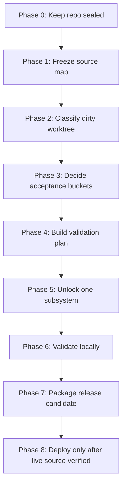

# SekaiLink Release-Safe Recovery Plan

Date: 2026-06-27  
Mode: scellage strict  
Source: `docs/SEKAILINK_FULL_REPO_AUDIT_2026-06-27.md`  
Status: planning only, no code changes authorized.

## Prime Directive

Until explicitly unlocked, SekaiLink is in sealed recovery mode.

Forbidden:

- no code modification;
- no file move;
- no deletion;
- no cleanup;
- no refactor;
- no bug fix;
- no live server touch;
- no quarantine/legacy/backups touch;
- no deploy;
- no push.

Allowed:

- read repository state;
- read documentation;
- produce markdown documents;
- produce read-only commands;
- classify files by system, risk, status, and priority.

## Recovery Goal

Recover a release-safe path without making the repository worse.

Release-safe means:

1. one explicit source of truth;
2. no hidden dependency on untracked files;
3. no live server ambiguity;
4. no accidental use of quarantine, legacy, or backup sources;
5. no feature work until the current worktree is understood;
6. every future change scoped to one subsystem with a validation gate.

## Current Ground Truth

| Area | Current state | Release risk |
|---|---|---|
| Canonical repo | Active source of truth, dirty worktree with 410 entries. | High |
| Client Core | Product-facing, large dirty UI/runtime launch changes. | High |
| Electron main refactor | `main.cjs` reduced, but depends on mostly untracked `electron/lib/*`. | Critical |
| Sekaiemu | Runtime shell, ImGui/debug/memory work dirty. | High |
| SKLMI | Runtime bridge active and dirty. | High |
| Runtime/AP wrappers | Active compatibility layer, mixed upstream/custom/local files. | Critical |
| Link server | Live source-of-truth not fully reconciled. | Critical |
| Nexus server | Critical identity/config path, dirty. | Critical |
| Worlds/generator | APWorld/version/ROM requirements fragile. | Critical |
| PopTracker | BETA-3 tracker path, fork/source/runtime must stay credited. | Medium-high |
| Quarantine/legacy | Historical only. Must not be touched. | Critical if confused |

## Release-Safe Recovery Phases



## Phase 0: Seal Confirmation

Purpose: prevent further drift while the recovery map is built.

Actions allowed:

- read `git status`;
- read docs;
- produce markdown checklists.

Exit criteria:

- this document exists;
- `SEKAILINK_FULL_REPO_AUDIT_2026-06-27.md` is accepted as current map;
- future work is forced through subsystem unlocks.

Read-only commands:

```bash
git -C <local-home>/SekaiLink/canonical status --short
git -C <local-home>/SekaiLink/canonical diff --stat
git -C <local-home>/SekaiLink/canonical log -1 --date=iso --oneline
```

## Phase 1: Freeze Source Map

Purpose: make it impossible to accidentally work from the wrong repo.

System classification:

| System | Source of truth during recovery | Forbidden sources |
|---|---|---|
| Client Core | `apps/client-core` | quarantine client, GDrive backup, Windows stale copy |
| Bootloader | `apps/client-core/bootstrapper`, `apps/client-core/native-bootloader` | old release bundles |
| Sekaiemu | `apps/sekaiemu` | old `Sekaiemu-Libretro-Spike-Codex` workspaces |
| SKLMI | `services/sklmi` | legacy standalone `sklmi` unless read-only archaeology |
| AP runtime/wrappers | `runtime/ap`, `runtime/*wrapper.py`, `runtime/modules` | local Archipelago installs, cache dirs |
| PopTracker runtime | `runtime/poptracker`, `third_party/upstream/poptracker-sekailink` | old legacy PopTracker clones |
| Link server | unresolved: must reconcile before deploy | live host local source, source snapshots, old split repo |
| Nexus server | `services/nexus`, pending live verification | old split repo, mounted server copy |
| Worlds/generator | `services/worlds` plus `runtime/ap`, pending live verification | local AP caches, old APTest trees |

Exit criteria:

- no subsystem is unlocked until its source is confirmed;
- Link/Nexus/Worlds are treated as deploy-blocked until live source maps are reconciled.

## Phase 2: Classify Dirty Worktree

Purpose: turn 410 dirty entries into review buckets.

Buckets:

| Bucket | Meaning | Release action |
|---|---|---|
| Accept candidate | Likely required for current BETA-3 path. | Review, test, then stage later. |
| Needs provenance | Binary or generated artifact that must match source. | Do not accept until source build is reproduced. |
| Runtime resource | APWorld, tracker pack, module manifest, core, Python dependency. | Validate against game support matrix. |
| Documentation | Docs and handoff records. | Safe to review first. |
| Historical | Legacy/source snapshot/reference material. | Do not stage for release. |
| Unknown | Cannot infer purpose safely. | Leave untouched until explained. |

Priority order:

1. Documentation and source maps.
2. Electron refactor files required by `main.cjs`.
3. Client Core launch/lobby context.
4. Runtime manifests and game registry.
5. Sekaiemu source.
6. SKLMI source.
7. AP wrappers/APWorld client changes.
8. PopTracker runtime/fork changes.
9. Services only after live source reconciliation.
10. Binaries only after reproducible builds.

Read-only commands:

```bash
git -C <local-home>/SekaiLink/canonical status --short
git -C <local-home>/SekaiLink/canonical diff --name-status
git -C <local-home>/SekaiLink/canonical diff --numstat
```

## Phase 3: Acceptance Buckets By System

### Client Core

| Priority | Files | Decision needed |
|---|---|---|
| P0 | `apps/client-core/electron/main.cjs`, `apps/client-core/electron/lib/*` | Accept/reject as one refactor set. Do not split blindly. |
| P0 | `src/services/lobbyLaunchContext.ts`, `roomSessionLaunch.ts`, `liveLaunchContext.test.ts` | Preserve AP slot/account-name invariant. |
| P1 | `LobbyRoomPage.tsx`, `GameSelectionModal.tsx`, `LobbiesPage.tsx` | Review launch/generation/game-selection flow. |
| P1 | `LibraryPage.tsx`, `gameSetup.ts`, `sekailinkGameCatalog.ts` | Review availability and ROM import behavior. |
| P2 | `SettingsPage.tsx`, i18n/theme/chat/Pulse files | Product polish, not release blocker unless broken at boot. |

Release-safe gate:

- clean build command documented;
- slot-name regression tests pass;
- launch modal cannot hide game selection;
- unavailable games stay unavailable;
- no direct Client Core self-update path except notification-to-bootloader.

### Sekaiemu

| Priority | Files | Decision needed |
|---|---|---|
| P0 | `runtime_memory_server.cpp`, memory utils/socket utils | Must preserve core memory bridge. |
| P0 | `libretro_host_*`, `libretro_environment.cpp` | Must preserve core loading and memory domains. |
| P1 | `runtime_activity_feed_imgui*`, `bridge_terminal_presenter*` | Keep debug UI useful but avoid breaking runtime. |
| P1 | `runtime_chat_overlay.cpp` | Separate chat from AP technical logs. |
| P2 | menu/context/hint/toaster UI | Can ship partial only if non-invasive. |

Release-safe gate:

- SNES frozen games still launch and communicate;
- GBA confirmed games still launch and communicate;
- debug UI can be disabled or ignored without breaking gameplay;
- runtime binary is rebuilt from source and provenance recorded.

### SKLMI

| Priority | Files | Decision needed |
|---|---|---|
| P0 | `api_bridge_runtime.cpp`, `api_archipelago.cpp`, `runtime_main.cpp` | Confirm current wrapper bridge contract. |
| P1 | `api_manifest.cpp`, headers | Confirm module/manifest API matches Client Core runtime expectations. |

Release-safe gate:

- no native tracker requirement for BETA-3;
- no game-specific hacks hidden in generic layer without docs;
- binary provenance recorded.

### Runtime/AP Wrappers

| Priority | Files | Decision needed |
|---|---|---|
| P0 | `runtime/apclient_common.py`, wrappers | Confirm headless AP client lifecycle. |
| P0 | `runtime/ap/CommonClient.py`, `NetUtils.py` | Confirm protocol version compatibility. |
| P0 | `runtime/modules/*/manifest.json` | Confirm availability, core, client, tracker, ROM hash. |
| P1 | `runtime/ap/worlds/*/Client.py` modifications | Keep only necessary compatibility adapters. |
| P1 | `runtime/patcher_wrapper.py` | Prevent GUI prompts and repeated patching. |

Release-safe gate:

- no game marked available without a module manifest and validation note;
- AP slot name is preserved end-to-end;
- wrappers do not require user-installed Python;
- local AP runtime version matches generator/server expectations.

### PopTracker

| Priority | Files | Decision needed |
|---|---|---|
| P0 | `runtime/poptracker/sekailink-poptracker*` | Determine whether current binary is source-built and from which commit. |
| P0 | `third_party/upstream/poptracker-sekailink` | Confirm UI-only fork policy. |
| P1 | `runtime/poptracker/packs/*` | Confirm bundled packs for available games. |

Release-safe gate:

- title/branding says `PopTracker - Sekailink Edition`;
- upstream credit preserved;
- no logic/loading behavior changed unless explicitly documented;
- packs exist only for games that expose tracker support.

### Link/Nexus/Worlds Services

| Priority | Files | Decision needed |
|---|---|---|
| P0 | `docs/repo-cleanup/LIVE_SERVICE_MAP.md` | Must be completed before deploy. |
| P0 | `services/link-social/*`, `services/link-room/*` | Reconcile source against live binary. |
| P0 | `services/nexus/*` | Reconcile source against live identity/config service. |
| P0 | `services/worlds/*`, `/opt/sekailink-generate` relationship | Reconcile generator source and APWorld versions. |

Release-safe gate:

- no service deploy from unconfirmed source;
- live binary path, config path, backup path, and source path are documented;
- rollback plan exists before restart;
- generation reset route behavior is understood.

## Phase 4: Validation Matrix Before Any Release Candidate

### Minimal Product Gates

| Gate | Required outcome |
|---|---|
| App boots | Client Core opens to login/dashboard without JS errors. |
| Login/session | Auth works; session persists as expected. |
| Lobby list | Lobbies load with clear loading/error state. |
| Config list | User configs load; unavailable games are hidden/disabled. |
| Generate | Supported games generate or show true generator error. |
| Launch | If multiple configs exist, game selection appears before launching modal. |
| Runtime | Sekaiemu launches correct patched ROM and core. |
| Tracker | PopTracker launches for games with supported packs. |
| AP slot | Slot name is never replaced by account display name. |
| Reports/logs | Errors can be captured for bug reports. |

### Compatibility Gates

| Family | Required before release |
|---|---|
| SNES | Do not reopen generic SNES. Smoke one frozen game only to detect regression. |
| NES | Confirm available list and do one smoke test. |
| GBA | Smoke MZM/Fusion/Minish/Wario only. |
| GB/GBC | Keep unavailable. |
| N64/GC/Wii | Keep unavailable. |

### Server Gates

| Service | Required before release |
|---|---|
| Link | Source-of-truth confirmed; lobby/generation/reset behavior known. |
| Nexus | Identity/config storage confirmed; admin access secured. |
| Worlds | APWorld/generator version confirmed; ROM requirement handling documented. |

## Phase 5: Unlock Protocol

When Jade decides to work again, unlock only one subsystem at a time.

Unlock template:

```text
UNLOCK SUBSYSTEM: <name>
Allowed paths:
- <path>
- <path>

Forbidden paths:
- quarantine
- legacy
- live servers
- backups

Goal:
<one sentence>

Validation:
<exact test/build/manual check>
```

No unlock means no code changes.

## Phase 6: Recommended First Unlocks Later

Do not execute these now. This is the future release-safe order.

1. Documentation-only acceptance.
2. Client Core Electron refactor review.
3. Client Core launch/slot invariant review.
4. Runtime module availability review.
5. Sekaiemu binary provenance review.
6. PopTracker runtime provenance review.
7. Services source-of-truth reconciliation.
8. Release candidate packaging.

## Read-Only Command Library

These are safe during scellage:

```bash
git -C <local-home>/SekaiLink/canonical status --short
git -C <local-home>/SekaiLink/canonical diff --stat
git -C <local-home>/SekaiLink/canonical diff --name-status
git -C <local-home>/SekaiLink/canonical diff --numstat
git -C <local-home>/SekaiLink/canonical log -5 --date=iso --oneline
find <local-home>/SekaiLink/canonical/docs -type f -printf '%TY-%Tm-%Td %TH:%TM\t%s\t%p\n' | sort -r
```

Avoid during scellage:

```bash
git add
git commit
git checkout
git reset
git clean
git pull
git push
npm install
npm run build
cmake --build
rsync
scp
ssh live-server '...'
```

## Release-Safe Definition Of Done

SekaiLink becomes release-safe only when:

- canonical source is the only accepted active source;
- dirty worktree is classified and intentionally accepted or deferred;
- required untracked files are no longer invisible risk;
- live service source maps are resolved;
- binaries have build provenance;
- game availability matches documented support;
- no unsupported game is exposed as playable;
- launch path preserves AP slot names;
- bootloader update path is cleanly separated from Client Core;
- PopTracker credit and fork boundary are clear.

## Final Recovery Posture

The next move is not to code.

The next move is to reduce ambiguity until a release candidate can be cut from known-good surfaces. The project should recover by locking scope, validating one boundary at a time, and refusing to let old archives or live server copies become accidental source.

