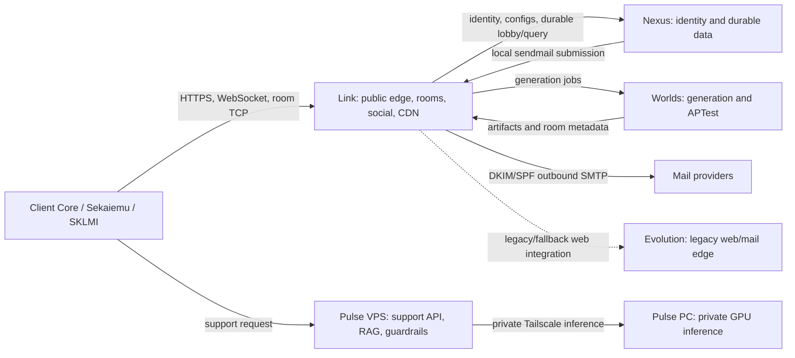

# SekaiLink Technical Context for AI and New Team Members

Last verified: 2026-07-13 (America/Toronto)

## Purpose of this document

This is a sanitized technical handoff for a new developer, operator, or AI
assistant working on SekaiLink. It explains what the project is, how its major
parts fit together, which systems are authoritative, how production is split
across servers, how the Nexus data layer works, and which games are currently
visible as supported in Client Core.

This document intentionally contains no passwords, API keys, session tokens,
private keys, database credentials, private network addresses, personal email
addresses, or SSH usernames. Public service domains are included because they
are part of the product architecture. Operational credentials belong only in
the private local operations file and secret stores; they must never be copied
into source control, chat, tickets, screenshots, or AI memory.

Machine capacities and service states are a dated snapshot. Recheck live state
before capacity planning, deployment, or incident response.

## Project in plain language

Archipelago is a multiworld randomizer ecosystem. A randomizer moves useful
items away from their normal locations. In a multiworld session, an item found
in one player's game may belong to another player or even another game. The
Archipelago server keeps the authoritative item/location protocol and routes
items to the correct slots.

SekaiLink is a desktop-first accessibility and orchestration layer around that
ecosystem. It reduces the number of independent tools and manual steps a player
must understand. It helps a player:

- create an account and reusable game configurations;
- understand which legally obtained base ROM is compatible;
- import and verify ROMs locally without distributing copyrighted ROM data;
- create or join synchronous and asynchronous lobbies;
- generate Archipelago-compatible multiworld seeds;
- launch the correct game, emulator/core, tracker, and synchronization runtime;
- exchange checks and items with the room server;
- see human-readable activity, chat, pending items, notifications, and hints;
- submit useful bug reports containing the relevant session logs;
- install larger native PC integrations separately through the App Store flow.

SekaiLink does not replace Archipelago's world logic or protocol. APWorlds are
the source of truth for generation rules, options, item IDs, location IDs,
patching, and goal semantics. SekaiLink packages and coordinates those pieces
in a lower-friction user experience.

## Repository and release model

Canonical source repository:

```text
/home/thelovenityjade/SekaiLink/canonical
```

Important top-level areas:

| Path | Responsibility |
| --- | --- |
| `apps/client-core` | Electron desktop application and primary player UI |
| `apps/sekaiemu` | Native libretro-based emulator and minimal runtime HUD |
| `services/sklmi` | Memory/runtime bridge between games and room protocol |
| `services/link-room` | Native Link room server implementation |
| `services/link-social` | Lobby, social, chat, and public API orchestration |
| `services/nexus` | Identity, durable user/config/lobby/query services |
| `services/worlds` | Generation worker and APWorld integration |
| `services/evolution` | Historical web/distribution/mail-edge components |
| `services/social-bots` | Discord/social automation and bug-report integration |
| `runtime` | Packaged AP runtime, modules, profiles, cores, trackers, tools |
| `cdn` | Update and separately downloadable PC package definitions |
| `docs` | Architecture, debug sessions, security notes, support matrix |

The project uses two update channels:

- **Canonical** is the approved stable release line.
- **Canary** is the validation line for fixes and integrations. A Canary build
  must not become Canonical without explicit release approval.

The native bootstrapper installs and updates Client Core. Client Core can also
update the bootstrapper. Update payloads must include the full runtime and all
required native DLL/shared-library dependencies; partial DLL sets have caused
real Windows failures. Windows builds must be produced and validated on the
Windows build machine, not cross-compiled and assumed correct.

## Languages and technology stack

SekaiLink is a polyglot system because it combines a desktop UI, native
emulation, native services, Archipelago Python worlds, and tracker packs.

| Area | Main technologies |
| --- | --- |
| Client Core UI | TypeScript, React 18, Vite, Tailwind CSS, Framer Motion |
| Desktop shell | Electron 28, Node.js, CommonJS bridge modules |
| Native services | C++ with CMake, JSON/HTTP/TCP and SQLite/MariaDB clients |
| Sekaiemu | C++, CMake, SDL/libretro cores, OpenGL/native window handling |
| SKLMI | C++, CMake, game-specific/generated runtime manifests |
| Archipelago runtime | Python and APWorld packages |
| Trackers | PopTracker packs, Lua, JSON, images; Universal Tracker fallback |
| Server support scripts | Python, shell, PowerShell, JavaScript/Node.js |
| Data/configuration | JSON, JSONL, YAML, SQLite, MariaDB |
| Tests | C++ smoke binaries, Vitest, Playwright, Python smoke/bench scripts |

Large amounts of C/C++, Python, Lua, assets, and generated data in the tree are
vendored runtime or upstream integration material. Do not treat raw extension
counts as a measure of first-party code ownership.

## Desktop components

### Client Core

Client Core is the main player-facing application and the owner of social UI.
It handles login/session persistence, library and ROM import, game configs,
lobbies, generation requests, launch orchestration, activity/history, chat,
notifications, pending items, hints, settings, update channels, bug reports,
and separately downloadable native games/mods.

It launches child runtimes with explicit arguments and maintains per-session
metadata such as lobby ID, room title, module, slot, game, and local paths.
External runtime windows use SekaiLink-styled borderless chrome.

### Sekaiemu

Sekaiemu is the integrated native emulator. Its primary job is emulation, not
social networking. It loads libretro cores and the generated/patched game,
handles video/audio/input, exposes runtime memory access, and displays only a
small HUD: Chat, Activity, Hint, connection state, and at most four compact
toasts.

Complete chat, activity history, notification history, and hint selection live
in Client Core floating windows. A lightweight file channel carries HUD state
to Sekaiemu and open-window events back to Client Core. This channel must be
polled at a restrained interval and never every emulation frame.

### SKLMI

SKLMI is the synchronization and memory integration layer. It:

- reads game state and checked locations from Sekaiemu memory;
- converts game-specific memory observations into Archipelago checks;
- receives ordered items for the local slot;
- writes or queues items when the game is temporarily unsafe to modify;
- acknowledges delivery and reports runtime state;
- uses APWorld/module manifests so item and location IDs stay aligned.

SKLMI does not own lobbies, accounts, or social UI. The Link room server remains
authoritative for ordered room mutations. Robustness here is critical: item
identity must come from authoritative AP metadata/indices, never from a guessed
memory value or a stale UI event.

### Trackers

Client Core can launch a SekaiLink-compatible PopTracker runtime and inject the
server, port, and slot information. Game-specific PopTracker packs are preferred
when available. Universal Tracker is the fallback for supported games without
a dedicated pack. Tracker state is useful presentation, but it is not the
authority for whether an item was delivered to game memory.

### Native PC integrations

Large native integrations are distributed separately instead of inflating the
base Client Core update. Current work includes:

- Ship of Harkinian / Harkipelago for Ocarina of Time;
- 2Ship2Harkinian Archipelago for Majora's Mask;
- SM64EX Archipelago for Super Mario 64.

These packages require platform-specific builds and complete dependency
bundles. Their AP connection fields are supplied by SekaiLink at launch rather
than asking the player to re-enter room and slot details.

## Authority boundaries

These boundaries prevent duplicated truth and hard-to-debug desynchronization:

| Concern | Authority |
| --- | --- |
| AP item/location IDs, options, generation logic | APWorld / Archipelago runtime |
| Ordered live checks/items/pending delivery | Link room server |
| Memory reads/writes and safe item injection | SKLMI |
| Emulation, input, audio, video | Sekaiemu/libretro core |
| Accounts, sessions, configs, durable lobby records | Nexus |
| Seed generation and artifacts | Worlds |
| Chat, activity, notifications, hints UI | Client Core, backed by Link/Nexus APIs |
| AI help and config explanation | Pulse, non-critical |
| Tracker visualization | PopTracker/Universal Tracker, non-authoritative |

## Production topology

SekaiLink uses five public-facing logical servers plus one private GPU worker.
Public traffic is routed through TLS reverse proxies and internal services bind
to loopback where possible. Cross-server service links use controlled tunnels
or authenticated internal APIs. Browser clients must never receive server
admin tokens.



### Link

Public domain: `link.sekailink.com`

Link is the runtime and public orchestration hub:

- public web host and reverse proxy;
- live and async lobby runtime;
- native room server for checks, items, pending queues, and runtime events;
- social/chat APIs, direct messages, presence, and lobby chat;
- Discord/social bots and bug-report routing;
- Client Core/Bootstrapper update CDN and PC package CDN;
- admin gateway/panel backend;
- tunnels to Nexus, Worlds, Pulse, and Evolution;
- outbound SMTP relay with SPF/DKIM alignment.

Important live service families include room server, lobby runtime, chat API and
daemon, social bots, webhost, admin gateway, and internal server tunnels.

### Nexus

Public domain: `nexus.sekailink.com`

Nexus is the durable core:

- user identity, registration, email verification, login, sessions, devices;
- profiles, roles, permissions, Patreon linkage, account audit;
- reusable game configurations and versioned APWorld option schemas;
- durable lobby administration and audit;
- query-friendly room/event/client-report projections;
- central MariaDB storage plus service-owned SQLite databases;
- private admin agents.

Nexus does not run emulation or live room mutation ordering. Link proxies public
identity/config/lobby calls to Nexus through controlled internal routes.

### Worlds

Public domain: `worlds.sekailink.com`

Worlds performs CPU/storage-heavy generation work:

- validates config payloads against the installed APWorld set;
- runs Archipelago/MultiworldGG generation;
- builds patches and per-slot artifacts;
- reports job state and errors back to Link;
- hosts generation and SMART services;
- hosts the isolated APTest environment when explicitly enabled.

Worlds is the generation authority, but generated room runtime is subsequently
served by Link.

### Pulse

Public domain: `pulse.sekailink.com`

Pulse VPS is the safe public/orchestration layer for AI assistance:

- authenticated/public support API routing;
- retrieval-augmented generation (RAG);
- APWorld and SekaiLink support index;
- deterministic fast paths for ROM hashes, support state, trackers, and patches;
- security guardrails, rate limits, validation, and audit logs;
- daily support regression bench.

Pulse is non-critical. Login, generation, lobbies, and gameplay must continue
when Pulse is unavailable. The VPS forwards inference privately to Pulse PC;
clients never connect to Pulse PC or Ollama directly.

Current Pulse stack snapshot:

| Item | Current value |
| --- | --- |
| Public support endpoints | `POST /api/support-ask`, `GET /api/support-health` |
| Active model name | `sekailink-pulse:7b` |
| Base model | `qwen2.5:7b-instruct` |
| Inference engine | Ollama 0.31.1 on Pulse PC |
| Model package size | approximately 4.7 GB |
| Quantized family | Qwen 2.5 7B Instruct |
| RAG index | 2,141 rows at the 2026-07-04 validation snapshot |
| Base APWorld option rows | 1,665 |
| SekaiLink game-info rows | 74 |
| Local APWorld documentation rows | 395 |
| Archipelago summary rows | 7 |
| Latest recorded support bench | 16/16 passing |
| Web search default | disabled for support requests |

An older local `llama.cpp`/3B model remains as a VPS-side component/reference,
but the active RAG and console path uses the 7B Ollama model on Pulse PC.
Pulse must admit uncertainty and ask one short clarification when it cannot
ground an answer. It must refuse server administration, secrets, deployment,
SSH, or destructive requests.

### Evolution

Public domain: `evolution.sekailink.com`

Evolution is the historical edge/web/mail machine. It currently retains:

- Apache-hosted historical or fallback web components;
- legacy Postfix/mail-edge components;
- an Evolution admin agent;
- retired API/reference material.

Evolution is no longer the durable account/database authority. Nexus is. The
currently validated account-email path is Nexus local submission to Link's
outbound SMTP relay; Evolution must not be assumed to be in that critical path.

## Server hardware snapshot

All VPS entries are virtual machines without a dedicated GPU.

| Machine | OS | CPU | RAM | Storage snapshot | Primary role |
| --- | --- | --- | --- | --- | --- |
| Evolution VPS | Ubuntu 22.04.5 LTS | 2 vCPU, AMD EPYC Milan virtual CPU | 1.9 GiB | 49 GB root, 23 GB free | Legacy web/mail edge |
| Link VPS | Debian 13 | 6 vCPU, Haswell-class virtual CPU | 11 GiB | 99 GB root, 54 GB free | Runtime, rooms, social, CDN, SMTP relay |
| Worlds VPS | Debian 13 | 8 vCPU, Haswell-class virtual CPU | 22 GiB | 197 GB root, 109 GB free | Generation, APWorlds, APTest |
| Nexus VPS | Fedora 43 Cloud | 4 vCPU, AMD EPYC Milan virtual CPU | 7.6 GiB | 73 GB root/67 GB free plus 98 GB data/93 GB free | Identity and durable data |
| Pulse VPS | Fedora 44 Cloud | 4 vCPU, Haswell-class virtual CPU | 7.6 GiB | 75 GB root, 69 GB free | Pulse API, RAG, guardrails |

## Development and build machines

These machines are not interchangeable. Build artifacts should be produced on
the target OS whenever native dependencies are involved.

| Machine | OS | CPU | RAM | GPU | Storage snapshot | Responsibility |
| --- | --- | --- | --- | --- | --- | --- |
| Devbox | Nobara Linux 44 KDE | Intel Core i7-10700F, 8C/16T | 15 GiB | GeForce RTX 3060 Ti, 8 GB | 929 GB root/home, 573 GB free | Canonical development, Linux build/test, operations |
| Gaming PC | Nobara Linux 44 KDE | AMD Ryzen 7 3800X, 8C/16T | 15 GiB | GeForce RTX 3060, 12 GB | 912 GB root/home, 151 GB free | Heavy native ports, PC game builds, GPU/dev validation |
| Windows PC | Windows 10 Pro 22H2, build 19045 | Xeon E5-1620 v3, 4C/8T | 32 GiB | Radeon RX 580, 4 GB | 476 GB system plus 466 GB SekaiLink workspace | Native Windows builds, packaging, installed-client update tests |
| Pulse PC | Windows 11 Home, build 26200 | Intel Core i7-14700F, 20C/28T | 16 GiB | GeForce RTX 5060 Ti, 16 GB | Persistent Pulse files on system disk; removable USB excluded | Private Ollama GPU worker |

Pulse PC is a shared computer. It is configured for one loaded model and one
parallel request, with strict timeouts. Access is restricted to the Pulse VPS
through Tailscale and a Windows firewall rule. It must never be exposed as a
public API or used as general persistent storage.

## Nexus data architecture

Nexus uses a hybrid persistence model rather than one monolithic database:

1. **Identity SQLite** is service-owned and stores users, sessions, verification
   and reset tokens, OAuth link state, keys, and auth audit.
2. **Lobby Admin SQLite** stores durable lobby definitions and lobby admin audit.
3. **MariaDB on the secondary Nexus data disk** stores shared/query-oriented
   game config schemas, versioned user configs, seed instances, and room/event
   projections used by APIs and admin tooling.
4. **Link SQLite databases** separately hold runtime lobby/social state. Those
   are not Nexus databases and must not be edited as a substitute for Nexus.

Service-owned databases reduce coupling, but cross-service operations are not a
single ACID transaction. Reconciliation and audit records matter when Link and
Nexus temporarily disagree.

### Identity domain

Main tables:

| Table | Purpose |
| --- | --- |
| `users` | Username, normalized email, profile, locale, role, permissions, verification and account state |
| `sessions` | Revocable device/client sessions with expiry and client metadata |
| `email_verification_tokens` | Hashed, expiring, single-use verification tokens |
| `password_reset_tokens` | Hashed, expiring, single-use reset tokens |
| `recovery_codes` | Hashed one-time recovery material |
| `oauth_link_states` | Expiring state for external account linking |
| `game_keys` | Entitlement/key state and optional user binding |
| `auth_audit` | Security-relevant identity events |

Passwords are hashed with Argon2id using per-password random salts and encoded
parameters. The current implementation defaults to a time cost of 3, 64 MiB
memory, parallelism 1, a 32-byte hash, and a 16-byte salt. Legacy iteration
metadata remains in the schema for compatibility. Plaintext passwords and raw
verification/reset tokens must never be stored or logged.

Sessions are bearer credentials. They are returned only through authenticated
flows, can be revoked individually or by device, and must be redacted from bug
reports. Email verification is asynchronous: Nexus submits mail locally, Link
signs/relays it, and Postfix queues retry temporary failures on disk.

### Seed configuration domain

Main tables:

| Table group | Purpose |
| --- | --- |
| `games` | Canonical game key, display name, system, support linkage/status |
| `game_option_schema_versions` | Immutable imported schema version and source hash |
| `game_option_groups` | UI grouping and ordering for options |
| `game_option_definitions` | Typed option metadata, defaults, validation, visibility |
| `game_option_choices` | Human labels mapped to APWorld YAML values |
| `user_game_configs` | Stable user-owned config identity |
| `user_game_config_versions` | Immutable values/YAML/schema validation history |
| `common_game_presets` and versions | Maintained reusable presets |
| `user_seed_instances` | Config/seed/room/slot lifecycle link |
| `seed_config_audit` | Who changed or generated what and when |

A config is always tied to the correct game's schema. The simple/wizard UI
must derive its questions from that schema; it must never apply a concept such
as ALTTP keysanity to an unrelated game that does not define it.

### Lobby and room data

Nexus lobby tables contain durable administration:

- lobby ID, name, description, visibility, owner, rules, metadata and status;
- created/updated/closed timestamps;
- audit entries for create, edit, close, moderation, and generation actions.

Link owns live runtime state:

- current participants and readiness;
- selected configs/slots;
- generation state;
- active room connection and last activity;
- ordered checks, items, pending delivery, acknowledgements, and room events.

Room projections copied into Nexus (`room_records`, `room_event_records`, and
`client_report_records`) make history and admin queries possible without making
Nexus the live ordering authority. A closed Nexus lobby that remains live on
Link is an operational inconsistency that should be reconciled and surfaced.

## Main data flows

### Login

1. Client Core sends the login request to the public Link API.
2. Link proxies the request to Nexus Identity through its controlled tunnel.
3. Nexus verifies Argon2id credentials/account state and creates a session.
4. Client Core stores the session using its persistent desktop session layer.
5. Later windows reuse the same Client Core session; they must not independently
   force the user to log in again.

### Lobby generation

1. Nexus stores the durable lobby and selected config references.
2. Link tracks players, readiness, and live selections.
3. The host starts generation after readiness and authorization checks.
4. Link submits a generation job to Worlds.
5. Worlds loads the installed APWorlds, validates YAML/options, and generates.
6. Worlds returns artifacts and slot metadata.
7. Link creates/activates the room runtime and exposes launch information.
8. Client Core downloads only the artifacts for the selected local slot.

The Compensator feature may retry a generation that fails specifically because
item and location counts are incompatible. It creates a lightweight Link-hosted
synthetic slot with a human-readable player/slot name, adds timed/check-count
locations or junk capacity as needed, announces itself in lobby chat, and can
be released by the host. Other generation failures must remain visible errors.

### Launch and runtime sync

1. Client Core verifies that the required ROM is present and validated.
2. It prepares the patched output and launches Sekaiemu/native game, SKLMI, and
   the selected tracker with explicit room/slot parameters.
3. SKLMI observes safe game memory and sends location checks to Link.
4. Link applies ordered room mutations and routes resulting items.
5. SKLMI queues incoming items while memory is unsafe, then writes and
   acknowledges them when safe.
6. Client Core receives social/activity/notification projections.
7. Tracker state updates independently as visualization.

When Sekaiemu exits, Client Core must close its runtime floating windows and
associated tracker/native child processes, while leaving Client Core itself
open.

### Goal completion

The AP server/APWorld announces slot goal completion. SKLMI/Client Core provide
the event to Sekaiemu. Sekaiemu persists an active-play timer per game/seed,
pauses and blurs emulation, and presents the synchronized completion screen and
music. Durable completion time/stat storage is intended to live in Nexus by
game and config; room/APWorld goal state remains authoritative.

### Bug report

Client Core can collect Client Core, SKLMI, Sekaiemu, bootstrapper, tracker, and
session logs; redact computer/user identity, paths, tokens, addresses, and other
personal data; optionally capture a user-approved screenshot; and send the
report to the Link bug-report API/Discord bot. Error dialogs should offer a
visible Report Bug action. Administrative export of Discord bug-report threads
must preserve status, discussion, attachments, and screenshots while obeying
privacy policy and access control.

## Supported game catalog

The source of truth for what the current Client Core visually enables is:

```text
apps/client-core/src/data/sekailinkGameCatalog.ts
```

As of this document, entries marked `available: true` are:

### SNES

- A Link to the Past
- Donkey Kong Country 2
- Donkey Kong Country 3
- EarthBound
- Kirby's Dream Land 3
- Lufia II
- Mega Man X3
- Secret of Evermore
- Secret of Mana
- Super Mario World
- SMZ3
- Super Metroid

### NES

- Mega Man 2
- Mega Man 3
- The Legend of Zelda
- Zelda II: The Adventure of Link

### Game Boy / Game Boy Color

- Link's Awakening DX
- Oracle of Ages
- Oracle of Seasons
- Pokemon Red and Blue
- Super Mario Land 2
- Wario Land

### Game Boy Advance

- Metroid Fusion
- Metroid: Zero Mission
- The Minish Cap
- Pokemon Emerald
- Pokemon FireRed
- Wario Land 4

### Native PC ports/integrations

- Ocarina of Time - Ship of Harkinian/Harkipelago
- Majora's Mask - 2Ship2Harkinian Archipelago
- Super Mario 64 - SM64EX Archipelago

`available` means exposed by the current client catalog; it does not imply that
every combination of APWorld options, every upstream APWorld version, and both
desktop operating systems have equal certification. Check each runtime module's
`availability_status`, compatibility notes, debug changelog, and Windows/Linux
verification before making a release claim.

Notable explicitly unavailable entries include Pokemon Crystal (game-specific
freeze/corruption), A Link Between Worlds, current Dolphin-dependent games, and
other catalog entries with `forceUnavailable: true`. Twilight Princess/Dusklight
is a separate work in progress and is not current general Dolphin support.

## Archipelago and APWorld integration

An APWorld is a Python package defining one game's Archipelago behavior:

- options and YAML schema;
- regions, entrances, items, locations and rules;
- item/location numeric IDs;
- generation stages and validation;
- patch creation and base ROM requirements;
- client/runtime hooks and goal completion.

SekaiLink installs the required APWorld set on Worlds and packages compatible
runtime resources in Client Core. An APWorld version mismatch can make an old
patch incompatible with a newer client/runtime; regenerate with aligned
versions rather than bypassing the version check.

SekaiLink-specific manifests map an AP game to emulator core, memory domains,
ROM requirements, patch extension, tracker, wrapper, and launch behavior. They
are adapters and packaging metadata, not a second independent copy of world
logic.

## APTest

APTest is an isolated private Archipelago/MultiworldGG test WebHost on Worlds.
Its purpose is to pretest APWorlds and randomizers without touching SekaiLink
production databases or room services.

Key properties:

- public test host: `aptest.sekailink.com` when enabled;
- full MultiworldGG source is used because a hybrid official-core tree cannot
  reliably load worlds that depend on MultiworldGG-specific core symbols;
- its Python environment, SQLite database, generated rooms, and systemd service
  are isolated from Link, Nexus, Evolution, and production Worlds data;
- it is a test bench, not a production dependency;
- at the 2026-07-13 snapshot, its service is disabled/inactive and must be
  deliberately enabled for a test session.

Never import APTest data directly into production or share its virtual
environment with the production generation service.

## Logging and diagnostics

Each native service emits systemd journal output plus service-specific state or
log files. Client-side sessions can include:

- bootstrapper logs;
- Client Core logs;
- SKLMI/companion logs;
- Sekaiemu logs;
- tracker logs;
- room/generation context and structured bug-report records.

Logs may contain local paths, OS usernames, room IDs, slot/player names,
IP/port information, machine specs, and fragments of request context. Token
redaction is mandatory, but "masked" must not be assumed without verification.
Logs and screenshots are personal/support data and require access control,
retention rules, deletion/export policy, and informed user consent.

For diagnosis, correlate by lobby ID, room ID, generation ID, slot, and UTC
timestamp. Do not diagnose item delivery from the tracker alone. Compare:

1. AP server/room event;
2. Link ordered item/check record;
3. SKLMI receive/queue/write/acknowledgement;
4. Sekaiemu memory safety and core behavior;
5. Client Core activity projection;
6. tracker presentation.

## Security and privacy rules for collaborators and AI

- Never place credentials or private addresses in code, docs, commits, issues,
  Discord, screenshots, or prompts.
- Never expose admin tokens to a browser renderer or public client.
- Treat session tokens, reset/verification links, OAuth state, logs, YAML/configs,
  screenshots, IPs, and device metadata as sensitive.
- Use least privilege, loopback binds, TLS, authenticated tunnels, firewall
  allowlists, and rate limiting.
- Preserve audit trails for account, moderation, lobby, generation, and admin
  actions.
- Redact local usernames/computer names before exporting bug reports.
- Do not distribute ROMs. Store only user-imported local ROM paths/hashes and
  generated patches/artifacts permitted by the integration.
- Confirm destructive actions and take backups before schema/data operations.
- Pulse is an explanation assistant, never an autonomous operations agent.
- AI assistance may support navigation, drafting, testing, and analysis; human
  maintainers remain responsible for architecture, security review, releases,
  and production actions.

## Safe onboarding checklist

1. Read this document and the root `README.md`.
2. Read the latest file in `docs/debug-sessions/` before changing behavior.
3. Check `git status`; never overwrite unrelated work in a dirty tree.
4. Identify the authority boundary affected by the proposed change.
5. Reproduce against Canary/local test infrastructure before touching Canonical.
6. Test Linux locally and Windows on the Windows build/test machine when native
   runtime or packaging changes are involved.
7. Verify full runtime dependencies, tracker packs, Universal Tracker resources,
   APWorld versions, and update manifest contents.
8. Do not deploy or promote to Canonical without explicit approval.
9. Update documentation and game-specific affected-game notes.
10. Keep secrets in private operational storage only.

## Related source documents

- `README.md`
- `docs/admin-panel-server-architecture.md`
- `docs/game-support/README.md`
- `docs/pulse-training/PULSE_STATUS_2026-07-04.md`
- `services/worlds/docs/aptest-multiworldgg.md`
- `runtime/game-registry/games.json`
- `runtime/modules/*/manifest.json`
- `apps/client-core/src/data/sekailinkGameCatalog.ts`

When this document conflicts with current code or live service configuration,
the current code plus a sanitized live inspection wins. Update this document
with a new verification date rather than silently preserving stale assumptions.
