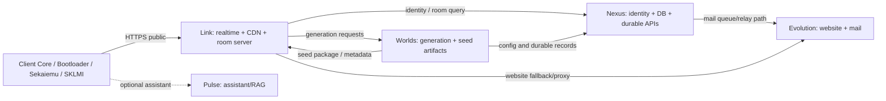
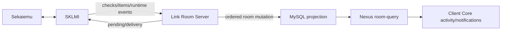

# SekaiLink - Documentation serveur pour prototype de panneau admin

Date: 2026-07-03

Ce document décrit l'architecture opérationnelle de SekaiLink BETA-3 pour aider
à prototyper un panneau admin. Il couvre les cinq serveurs, leurs rôles, les
flux de données, les bases de données, les lobbies, les room servers, les logs
et les surfaces d'administration utiles.

Les secrets, tokens, mots de passe, clés Discord, clés SMTP et identifiants de
base de données ne doivent jamais être copiés dans le panneau admin. Le panneau
doit lire ces valeurs par configuration serveur ou par un agent privé.

## Vue d'ensemble

SekaiLink est séparé en cinq machines logiques:

| Serveur | Domaine | Rôle principal |
| --- | --- | --- |
| Link | `link.sekailink.com` | Temps réel, room server, lobbies runtime, social/chat, CDN, logs runtime |
| Nexus | `nexus.sekailink.com` | Identité, comptes, sessions, base centrale, API durable, room-query |
| Worlds | `worlds.sekailink.com` | Génération, randomizers, patchs, artefacts de seed |
| Pulse | `pulse.sekailink.com` | Assistant interne/RAG/LLM pour options APWorld et aide config |
| Evolution | `evolution.sekailink.com` | Web/mail historique, site public, mail transport |

Le domaine public `sekailink.com` passe principalement par Link. Link garde les
routes publiques stables et proxifie les APIs durables vers Nexus lorsque
nécessaire. Evolution reste important pour le site et le mail, mais la base et
les APIs critiques ne doivent plus dépendre d'Evolution.



## Principes d'autorité

- Link est l'autorité runtime pour l'ordre des mutations temps réel: checks,
  items, pending items, room state, presence runtime.
- Nexus est l'autorité durable pour les utilisateurs, sessions, configs,
  lobbies administratifs et projections query-friendly.
- Worlds est l'autorité de génération: jobs, patches, output multiworld,
  artefacts de seed.
- Client Core est propriétaire de l'expérience sociale côté client: chat,
  activity, notifications, pending items, fenêtres runtime.
- SKLMI reste responsable de la lecture/écriture mémoire et de la sync runtime.
- Sekaiemu reste principalement un émulateur et ne doit pas devenir une surface
  sociale complète.
- Pulse est non critique. Si Pulse tombe, le jeu, les lobbies et la connexion
  doivent continuer à fonctionner.

## Serveur Link

### Rôle

Link est l'hôte temps réel. Il contient:

- room server natif
- async room server
- live lobby runtime
- social realtime
- chatrooms et private chat daemon
- room gateway
- CDN des clients et updates
- logs runtime détaillés
- admin agent privé

### Layout attendu

```text
/opt/sekailink/link/
  room-server/
    bin/
    config/
    data/
      audit/
      projection/
    runtime/
  lobby-runtime/
    bin/
    config/
    data/
  async-room-server/
  social-server/
  cdn/
  admin-agent/
  logs/
    room-server/
  spool/
```

### Services importants

| Service | Description |
| --- | --- |
| `sekailink-room-server.service` | Room server natif, mutations temps réel et surface admin privée |
| `sekailink-lobby-runtime.service` | Lobbies runtime ouverts, presence join/leave, close runtime |
| `sekailink-admin-agent.service` | Agent admin privé exposant room-server et lobby-runtime |
| `sekailink-chat-daemon.service` | Daemon de chat privé loopback |
| Services web/proxy | Terminaison publique et proxy vers Nexus/Evolution |

### Room server runtime

Chemins recommandés:

```text
/opt/sekailink/link/room-server/bin/sekailink_room_server_service
/opt/sekailink/link/room-server/config/room_server.json
/opt/sekailink/link/room-server/config/room_server.env
/opt/sekailink/link/room-server/runtime/room_server_state.json
/opt/sekailink/link/logs/room-server/service.log
```

Le fichier `room_server_state.json` contient normalement:

- `status`
- `started_at`
- `updated_at`
- `effective_tcp_host`
- `effective_tcp_port`
- `effective_http_host`
- `effective_http_port`
- `boot_room_count`
- `room_count`
- `stop_requested`
- `loopback_only`
- `admin_auth_enabled`
- `runtime_auth_enabled`
- `client_report_auth_enabled`
- `last_error`

Le panneau admin devrait afficher ce fichier en lecture structurée, avec un
badge de fraîcheur basé sur `updated_at`.

### Room server HTTP privé

La surface HTTP privée sert à inspecter, pas à remplacer la logique runtime.
Routes utiles:

```text
GET /health
GET /rooms
GET /rooms/{room_id}/summary
GET /rooms/{room_id}/snapshot
GET /rooms/{room_id}/events
GET /rooms/{room_id}/client-reports
```

Lorsque l'auth est activée, les routes admin demandent un bearer token serveur.
Le prototype admin ne doit jamais envoyer ce token au navigateur. Il doit passer
par un backend admin.

### Room server commandes privées

Commandes utiles exposées par l'agent ou CLI privé:

```text
listrooms [limit] [query] [room_type] [connection_state] [offset]
roomevents <room_id> [limit] [event_type] [severity] [offset]
clientreports <room_id> [limit] [report_type] [severity] [source] [offset]
roomsummary <room_id>
expiredrooms <now_utc>
purgeexpiredrooms <now_utc>
setroomallowed <room_id> <slot_csv>
setroomexpires <room_id> <expires_at|none>
setroomdailysummary <room_id> <state|none>
setroomnotifications <room_id> <state|none>
setroomsuspend <room_id> <state|none>
```

Actions destructives ou sensibles:

- `purgeexpiredrooms`
- fermer/suspendre une room
- modifier les slots autorisés
- modifier l'expiration
- couper les notifications

Ces actions doivent demander une confirmation explicite dans le panneau admin.

### Lobby runtime

Chemins:

```text
/opt/sekailink/link/lobby-runtime/bin/sekailink_lobby_runtime_service
/opt/sekailink/link/lobby-runtime/config/lobby_runtime.json
/opt/sekailink/link/lobby-runtime/data/lobby_runtime.sqlite3
/opt/sekailink/link/lobby-runtime/data/lobby_runtime_state.json
```

Le lobby runtime garde les lobbies ouverts côté temps réel:

- lobbies actuellement ouverts
- état runtime
- presence
- join/leave
- fermeture runtime
- last activity

Commandes utiles:

```text
listruntimelobbies [limit] [query] [visibility] [status] [offset]
```

Tables SQLite principales:

```text
lobby_runtime
  lobby_id
  name
  visibility
  status
  owner_username
  description
  metadata_json
  created_at
  updated_at
  last_activity_at

lobby_presence
  lobby_id
  username
  joined_at
  updated_at
```

### Link social/chat

Link contient aussi le service social/chat du Client Core. Les tables SQLite
importantes sont:

```text
chat_messages
  id
  channel_id
  user_id
  username
  display_name
  avatar_url
  content
  created_at

chat_presence
  channel_id
  user_id
  username
  display_name
  avatar_url
  role
  ready
  local_ready_known
  local_ready
  local_ready_note
  last_seen

social_profiles
  user_id
  username
  display_name
  avatar_url
  updated_at

social_settings
  user_id
  presence_status
  dm_policy
  updated_at

social_friends
  user_id
  friend_id
  created_at

social_friend_requests
  id
  from_id
  to_id
  status
  created_at
  updated_at

social_blocks
  user_id
  blocked_id
  created_at

social_dm_messages
  id
  from_id
  to_id
  content
  created_at
  read_at

lobby_game_selections
  lobby_id
  user_id
  selection_json
  updated_at

lobby_player_state
  lobby_id
  user_id
  username
  ready
  updated_at

lobby_generation_state
  lobby_id
  generation_id
  status
  room_url
  error
  players_json
  response_json
  created_at
  updated_at

world_configs
  id
  user_id
  title
  game
  content
  created_at
  updated_at
```

Pour le panneau admin, ces tables servent surtout à:

- voir le chat d'un lobby
- voir la présence
- voir qui est ready/local ready
- inspecter les sélections de jeux
- diagnostiquer une génération bloquée
- diagnostiquer les DM/friend requests si un bug social arrive

## Serveur Nexus

### Rôle

Nexus est le centre durable:

- identité
- comptes utilisateurs
- sessions et devices
- database centrale
- room-query
- lobby admin
- seed config API
- admin agent

### Layout attendu

```text
/opt/sekailink/nexus/
  auth/
  api-gateway/
  db/
  admin-agent/
  logs/
  run/

/srv/nexus-data/
  mysql/
  backups/
  logs/
  spool/
  artifacts/
```

### Services importants

| Service | Description |
| --- | --- |
| `mariadb.service` | Base MariaDB/MySQL centrale |
| `sekailink-nexus-identity.service` | Login, register, sessions, users |
| `sekailink-nexus-room-query.service` | Lecture durable des projections room |
| `sekailink-nexus-lobby-admin.service` | Lobbies administratifs durables |
| `sekailink-nexus-seed-config-api.service` | Configs de jeux, presets, options |
| `sekailink-nexus-admin-agent.service` | Agent admin privé Nexus |
| `sekailink-link-lobby-runtime-tunnel.service` | Pont vers Link lobby runtime |

### Identité

Tables principales:

```text
users
  id
  username
  email
  display_name
  avatar_url
  bio
  locale
  role
  permissions_json
  disabled_at
  email_verified
  patreon fields
  two_factor_enabled
  two_factor_secret_b32
  password_salt_b64
  password_hash_b64
  password_iterations
  created_at
  last_login_at

sessions
  id
  user_id
  session_token
  created_at
  expires_at
  revoked_at
  user_agent
  client_name
  client_version
  device_id
  requested_locale

recovery_codes
  id
  user_id
  code_hash_b64
  created_at
  used_at

password_reset_tokens
  id
  user_id
  token_hash_b64
  created_at
  expires_at
  used_at

email_verification_tokens
  id
  user_id
  token_hash_b64
  created_at
  expires_at
  used_at

oauth_link_states
  id
  user_id
  provider
  state_hash_b64
  created_at
  expires_at
  used_at

auth_audit
  id
  user_id
  event_type
  payload_json
  created_at

game_keys
  id
  key_code
  status
  entitlements_json
  created_at
  activated_at
  deactivated_at
  bound_user_id
  notes
```

Notes importantes:

- Les tokens et hashes ne doivent jamais être affichés en clair dans le panneau.
- Les sessions doivent pouvoir être révoquées.
- Les comptes doivent pouvoir être désactivés/réactivés.
- Le panneau doit afficher `auth_audit` autour d'un utilisateur.

Commandes privées utiles:

```text
adduser
listusers [limit] [query] [role] [state] [offset]
edituser
disableuser
enableuser
deluser
forcepasswordreset
userinfo
useraudit <username> [limit] [event_type] [offset]
listsessions
listdevices
revokesession
revokeothersessions
revokedevicesessions
```

### Lobby admin durable

Nexus garde la définition administrative des lobbies. Link garde leur état
runtime.

Tables:

```text
lobbies
  id
  lobby_id
  name
  visibility
  status
  owner_username
  description
  rules_json
  metadata_json
  created_at
  updated_at
  closed_at

lobby_admin_audit
  id
  event_type
  lobby_id
  actor_type
  request_context_json
  payload_json
  created_at
```

Commandes/routes utiles:

```text
addlobby
listlobbies [limit] [query] [visibility] [status] [offset]
editlobby
closelobby
lobbyinfo
```

Le panneau admin doit montrer les deux vues ensemble:

- Nexus lobby admin: vérité durable
- Link lobby runtime: état ouvert/présence/activité

Si un lobby est fermé dans Nexus mais encore ouvert sur Link, c'est une anomalie
à afficher.

### Seed config API

Tables principales:

```text
games
  game_key
  display_name
  system_key
  active_linkedworld_id
  status
  created_at
  updated_at

game_option_schema_versions
  game_id
  schema_version
  source_kind
  source_hash
  source_ref
  deprecated_at
  created_at

game_option_groups
  schema_version_id
  group_key
  label
  description
  sort_order

game_option_definitions
  schema_version_id
  group_id
  option_key
  yaml_key
  label
  description
  type
  default_json
  required
  sort_order
  visibility
  validation_json

game_option_choices
  option_id
  choice_key
  yaml_value
  label
  description
  sort_order

user_game_configs
  user_id
  game_id
  name
  description
  is_default
  current_version_id
  created_at
  updated_at
  archived_at

user_game_config_versions
  config_id
  schema_version_id
  values_json
  values_hash
  source_yaml
  validation_status
  validation_errors_json
  created_at

common_game_presets
  game_id
  preset_key
  name
  description
  category
  visibility
  sort_order
  is_active
  status
  archived_at

common_game_preset_versions
  preset_id
  schema_version_id
  values_json
  values_hash
  validation_status
  validation_errors_json
  created_at

user_seed_instances
  user_id
  game_id
  config_version_id
  seed_id
  room_id
  slot_id
  status
  created_at
  completed_at
  archived_at

seed_config_audit
  user_id
  event_type
  target_type
  target_id
  payload_json
  created_at
```

Admin panel utile:

- liste des jeux actifs/non disponibles/en apprentissage
- options importées par jeu
- configs utilisateur
- presets communs
- erreurs de validation
- seeds générées par utilisateur
- audit des changements de config

### Room-query et projection

Link écrit les projections de room. Nexus les lit pour donner une vue
query-friendly.

Tables de projection:

```text
room_records
  id
  room_id
  record_json
  created_at

room_event_records
  id
  room_id
  record_json
  created_at

client_report_records
  id
  room_id
  record_json
  created_at
```

Chaque `record_json` contient le payload structuré complet. Le panneau admin
devrait parser le JSON et ne pas afficher seulement du JSON brut.

## Serveur Worlds

### Rôle

Worlds est responsable des opérations lourdes:

- génération multiworld
- randomizers/APWorld
- validation de configs côté génération
- patchs et artefacts de seed
- SMART server
- dépôt git bare interne
- admin agent

### Layout attendu

```text
/opt/sekailink/worlds/
  generation-server/
    bin/
    config/
    data/
  smart-server/
  git/
  admin-agent/
  logs/
```

### Services importants

| Service | Description |
| --- | --- |
| `sekailink-generation-server.service` | Service de génération |
| `sekailink-worlds-admin-agent.service` | Agent admin privé Worlds |
| SMART server | Service interne pour génération/metadata selon configuration |

### Generation server

Chemins:

```text
/opt/sekailink/worlds/generation-server/bin/sekailink_generation_server_service
/opt/sekailink/worlds/generation-server/config/generation_server.json
/opt/sekailink/worlds/generation-server/data/generation_server_state.json
```

Le fichier d'état contient généralement:

- `tcp_port`
- `running`
- `total_requests`
- `total_errors`
- `job_counts`
- `updated_at`

Commandes admin utiles:

```text
submitgenjob
listgenjobs [limit] [query] [status] [sort_by] [order] [requested_after] [requested_before] [offset]
genjobinfo
```

Le panneau admin doit afficher:

- queue de génération
- jobs en cours
- jobs échoués
- durée
- jeu/module
- lobby associé
- utilisateur demandeur
- artifact/room URL si disponible
- erreur complète mais formatée lisiblement

## Serveur Pulse

### Rôle

Pulse est l'assistant interne. Il sert à aider avec les options APWorld, les
presets et les explications de config. Il ne doit pas être dans le chemin
critique d'une run.

### Layout attendu

```text
/opt/sekailink/pulse/
  models/
    pulse-current.gguf
  rag/
    indexes/
      apworld-options.jsonl
    datasets/
      pulse-train-v0.jsonl
      pulse-eval-v0.jsonl
  tests/
    run_pulse_smoke.py
```

### Services

| Service | Bind | Description |
| --- | --- | --- |
| `sekailink-pulse-llm.service` | `127.0.0.1:18181` | LLM local |
| `sekailink-pulse-rag-api.service` | `127.0.0.1:18182` | API RAG interne |

Guardrails:

- refuser les demandes non liées à APWorld/SekaiLink Sync
- bloquer les demandes sur SSH, secrets, deploy, admin, serveur
- ne jamais exposer Pulse publiquement sans proxy/auth stricts

Admin panel utile:

- statut des deux services
- âge de l'index RAG
- modèle actif
- résultat du dernier smoke test
- nombre de requêtes/erreurs si métriques disponibles

## Serveur Evolution

### Rôle

Evolution est l'hôte web/mail historique:

- Apache/PHP/site public
- transport mail
- état postfix
- composants API historiques retirés
- admin agent Evolution

Evolution ne doit plus être considéré comme l'autorité de base de données pour
les fonctions critiques. La base durable est côté Nexus.

### Layout attendu

```text
/opt/sekailink/evolution/
  web/
  mail/
  logs/
  admin-agent/
  _retired-api/
```

### Services importants

| Service | Description |
| --- | --- |
| `apache2.service` | Site web public/historique |
| `postfix.service` et `postfix@-.service` | Transport mail |
| `redis-server.service` | Support cache/queue si activé |
| `sekailink-evolution-admin-agent.service` | Agent admin privé |
| `sekailink-postfix-queue-state.service/timer` | Snapshot de queue mail |

Chemins utiles:

```text
/opt/sekailink/evolution/admin-agent/data/postfix_queue_state.json
/opt/sekailink/evolution/api-gateway/data/evolution_room_query_state.json
```

Le service `sekailink-postfix-queue-state` a déjà été observé en état `failed`.
Le panneau admin devrait l'afficher comme santé mail dégradée si c'est encore le
cas.

## Flux principaux

### Login et session

```mermaid
sequenceDiagram
  participant Client as Client Core / Bootloader
  participant Link as Link public HTTPS
  participant Nexus as Nexus Identity
  participant DB as Nexus DB

  Client->>Link: POST /api/identity/login
  Link->>Nexus: proxy identity request
  Nexus->>DB: validate user/password/session
  DB-->>Nexus: user + session
  Nexus-->>Link: session response
  Link-->>Client: token/session payload
```

Admin panel:

- voir sessions actives
- voir devices
- révoquer session
- forcer reset password
- voir audit login/errors

### Création de lobby et génération

```mermaid
sequenceDiagram
  participant Client as Client Core
  participant Nexus as Nexus Lobby Admin
  participant Link as Link Lobby Runtime
  participant Worlds as Worlds Generation
  participant Room as Link Room Server

  Client->>Nexus: create/update lobby
  Nexus->>Link: open runtime lobby
  Client->>Link: ready + game selections
  Link->>Worlds: submit generation job
  Worlds-->>Link: generated room package/artifacts
  Link->>Room: create/sync room runtime
  Room-->>Client: room URL/tickets/runtime state
```

Admin panel:

- lobby durable Nexus
- lobby runtime Link
- players/ready/configs
- generation state
- room created/not created
- errors from Worlds

### Runtime room sync



Admin panel:

- room snapshot
- checked locations
- received items
- pending items
- connected slots
- room events
- client reports
- delivery acknowledgements where exposed

### Bug report

Public endpoint:

```text
POST /api/client/bug-report
```

Sources:

- `bootloader`
- `client-core`
- `sekaiemu`
- `sklmi`

Payload important:

```json
{
  "title": "Bootloader error",
  "description": "sha256_mismatch",
  "reporter_name": "SekaiLink User",
  "logs_text": "tail of the relevant log",
  "system_info": {},
  "app_info": {
    "source": "bootloader",
    "component": "native-bootloader"
  }
}
```

Link normalise et transfère ensuite au bot Discord via une route serveur privée.
Le client ne doit jamais avoir de token Discord.

Admin panel:

- rechercher par source/component
- grouper par version/platform
- montrer logs tronqués
- lier bug report à room/lobby si `room_id` ou `lobby_id` existe
- masquer données sensibles

## Structure logique d'un lobby

Un lobby existe en deux couches:

1. Lobby admin durable sur Nexus.
2. Lobby runtime sur Link.

### Lobby durable Nexus

Champs importants:

- `lobby_id`
- `name`
- `visibility`
- `status`
- `owner_username`
- `description`
- `rules_json`
- `metadata_json`
- `created_at`
- `updated_at`
- `closed_at`

Cette couche sert à afficher l'historique, les règles, l'état officiel et le
propriétaire.

### Lobby runtime Link

Champs importants:

- `lobby_id`
- `name`
- `visibility`
- `status`
- `owner_username`
- `metadata_json`
- `created_at`
- `updated_at`
- `last_activity_at`

Presence:

- `lobby_id`
- `username`
- `joined_at`
- `updated_at`

Cette couche sert à savoir ce qui est ouvert maintenant et qui est présent.

### Sélections et readiness

Côté social/chat:

- `lobby_game_selections.selection_json` garde la sélection de jeu/config du
  joueur.
- `lobby_player_state.ready` indique si le joueur est prêt.
- `lobby_generation_state` garde le statut de génération associé au lobby.

Le panneau admin devrait afficher une page lobby avec:

- résumé durable
- état runtime
- players
- ready state
- selected game/config
- generation job/status
- room id/url si généré
- chat/activity récente
- bouton close/suspend/admin notes

## Structure logique d'une room

Une room est la session de sync runtime. Elle est plus proche d'Archipelago que
du lobby UI.

Données typiques:

- `room_id`
- `room_type`
- `game`
- `seed_id`
- `seed_name`
- `seed_hash`
- `tracker_pack`
- `tracker_variant`
- slots
- connected players
- slot data
- received items
- pending items
- checked locations
- missing locations
- room events
- client reports
- expiration
- suspend/notification flags

Le room server garde l'ordre des mutations. La projection MySQL garde une copie
append/query-friendly.

Pour diagnostiquer un bug de sync:

1. Voir si le client a envoyé un client report.
2. Voir si la room existe sur Link.
3. Lire le room summary.
4. Lire le snapshot complet.
5. Vérifier les events autour du timestamp.
6. Vérifier les pending items et delivery/ack si exposés.
7. Comparer avec la projection Nexus room-query.

## Logs serveur

### Logs systemd

Tous les services importants doivent être lisibles avec:

```bash
journalctl -u <service> --since "1 hour ago"
journalctl -u <service> -f
systemctl status <service>
```

Le panneau admin ne devrait pas donner un shell brut. Il devrait exposer:

- statut service
- uptime
- derniers logs
- filtre par room/lobby/job/user
- bouton "copy diagnostic bundle"

### Logs Link

Chemins et sources:

```text
/opt/sekailink/link/logs/room-server/service.log
/opt/sekailink/link/room-server/runtime/room_server_state.json
/opt/sekailink/link/lobby-runtime/data/lobby_runtime_state.json
journalctl -u sekailink-room-server.service
journalctl -u sekailink-lobby-runtime.service
journalctl -u sekailink-admin-agent.service
journalctl -u sekailink-chat-daemon.service
```

Contenu attendu:

- lifecycle service
- room creation/removal
- checks/items
- client reports
- projection errors
- expired room purge
- stalled TCP clients

### Logs Nexus

Sources:

```text
/srv/nexus-data/logs/
/opt/sekailink/nexus/logs/
journalctl -u mariadb.service
journalctl -u sekailink-nexus-identity.service
journalctl -u sekailink-nexus-room-query.service
journalctl -u sekailink-nexus-lobby-admin.service
journalctl -u sekailink-nexus-seed-config-api.service
journalctl -u sekailink-nexus-admin-agent.service
```

Contenu attendu:

- login/register/session
- DB errors
- room-query errors
- lobby admin/tunnel errors
- seed config validation
- audit operations

### Logs Worlds

Sources:

```text
/opt/sekailink/worlds/logs/
/opt/sekailink/worlds/generation-server/data/generation_server_state.json
journalctl -u sekailink-generation-server.service
journalctl -u sekailink-worlds-admin-agent.service
```

Contenu attendu:

- generation job accepted
- APWorld validation
- patch errors
- missing ROM/base file errors
- artifact paths
- Python/APWorld traceback
- total errors and job counts

### Logs Pulse

Sources:

```text
journalctl -u sekailink-pulse-llm.service
journalctl -u sekailink-pulse-rag-api.service
/opt/sekailink/pulse/tests/run_pulse_smoke.py
```

Contenu attendu:

- model load
- RAG index load
- request refusal by guardrails
- local API errors

### Logs Evolution

Sources:

```text
/var/log/apache2/
/var/log/mail.log or journalctl postfix units
/opt/sekailink/evolution/logs/
/opt/sekailink/evolution/admin-agent/data/postfix_queue_state.json
journalctl -u apache2.service
journalctl -u postfix.service
journalctl -u sekailink-evolution-admin-agent.service
journalctl -u sekailink-postfix-queue-state.service
```

Contenu attendu:

- website 404/500
- mail queue
- failed delivery
- postfix state snapshot

## Releases, CDN et updates

Link/CDN sert les builds Client Core, bootloader, AppImage, NSIS et patches
update.

Concepts:

- `canonical`: release stable publique
- `canari/canary`: release de test avant promotion
- `test`: canal de validation si configuré
- update bundle: patch consommé par le bootloader
- installer: NSIS Windows ou AppImage Linux distribué à part

Le panneau admin devrait afficher:

- canal
- plateforme
- version
- date
- manifest URL
- artifact URL
- SHA256
- taille
- fallback disponible
- dernière version connue du bootstrapper
- espace disque CDN par release

Règle opérationnelle utile:

- garder la build courante et une build fallback
- nettoyer les builds plus anciennes après validation
- ne jamais supprimer la fallback pendant une release active

## Écrans recommandés pour un prototype admin

### 1. Fleet overview

But: voir si SekaiLink est vivant.

Cartes:

- Link
- Nexus
- Worlds
- Pulse
- Evolution

Chaque carte:

- online/offline
- CPU/RAM/disk
- services critiques
- derniers errors
- dernier heartbeat/state update

### 2. Users and sessions

Fonctions:

- rechercher utilisateur
- voir profil/account state
- sessions/devices
- audit auth
- révoquer session
- disable/enable account
- force password reset

Protection:

- ne jamais afficher password hash/token
- loguer toute action admin

### 3. Lobbies

Fonctions:

- liste lobbies Nexus
- statut runtime Link
- filtre owner/status/visibility
- voir players/ready/game selection
- voir generation state
- close lobby
- forcer expiration si nécessaire

### 4. Rooms

Fonctions:

- liste rooms actives/expirées/suspendues
- summary
- snapshot
- room events
- client reports
- connected players
- pending items
- checked/missing counts
- expiration controls
- suspend controls

### 5. Generation jobs

Fonctions:

- liste jobs
- statut
- temps en queue
- temps d'exécution
- game/module
- requester/lobby
- output artifacts
- traceback formaté

### 6. Social/chat

Fonctions:

- lobby chat read-only admin
- presence
- friend request diagnostics
- DM diagnostics sur bug seulement
- activity feed technique si exposé

### 7. Bug reports

Fonctions:

- liste par source/component/version/platform
- search full text logs tronqués
- voir screenshot si présent
- associer room/lobby/user
- statut triage: new/ongoing/fixed/known

### 8. Releases/CDN

Fonctions:

- versions canonical/canary
- manifests
- artifacts
- SHA256
- bootstrapper versions
- disk usage
- promote canary to canonical
- rollback to fallback

### 9. Mail

Fonctions:

- postfix queue
- mail delivery errors
- identity email status
- queue age

### 10. Pulse

Fonctions:

- service status
- model active
- RAG index age
- smoke test
- guardrail errors

## Actions admin à sécuriser

Actions qui demandent confirmation:

- fermer un lobby
- fermer une room
- purger rooms expirées
- restart service
- delete artifact/build
- revoke all sessions
- disable user
- promote canary to canonical
- rollback release
- clear cache serveur

Chaque action doit écrire un audit:

```text
admin_user
action
target_type
target_id
payload_summary
created_at
request_ip
result
error
```

## Données à ne jamais afficher en clair

- `session_token`
- bearer tokens
- room server admin/runtime/client report tokens
- Discord bot key
- SMTP password
- DB password
- password hashes/salts
- recovery code hashes
- reset token hashes
- email verification token hashes
- OAuth state hashes

Le panneau peut afficher:

- les quatre derniers caractères d'un id non secret
- `created_at`
- `expires_at`
- `revoked_at`
- `device_id` si non sensible
- `client_name/client_version`

## Santé et alertes recommandées

Alertes critiques:

- Link room server down
- Nexus identity down
- Nexus DB down
- Worlds generation down
- CDN manifest manquant ou SHA mismatch
- room projection write errors
- room-query ne lit plus la projection
- disk usage > 85%
- mail queue bloquée

Alertes warning:

- Pulse down
- Evolution postfix queue state failed
- trop de client reports sur une version
- génération errors spike
- room server lag ou TCP timeout spike
- lobbies runtime ouverts depuis plus de 24h sans activité
- rooms non async expirées non purgées

## Règles d'expiration lobby/room

Règle souhaitée:

- Les lobbies/rooms non async doivent expirer après 24h sans activité.
- Une room peut aussi être fermée quand tous les joueurs ont goal completed.
- Les async lobbies sont fermés par le host ou par completion.

Le panneau admin doit distinguer:

- active
- idle
- expired
- closed
- completed
- suspended
- async

## Notes pour le prototype

La première version du panneau admin peut être read-mostly:

1. Fleet overview.
2. Users/sessions read + revoke session.
3. Lobbies read + close lobby.
4. Rooms read + events + client reports.
5. Generation jobs read.
6. Bug reports read.
7. Releases read.

Ensuite ajouter les actions dangereuses une par une avec audit.

Ne pas faire parler le frontend directement aux services loopback. Le bon modèle:

```text
Admin browser
  -> Admin backend authenticated
  -> per-host admin agent / SSH-controlled collector / private service API
  -> Link/Nexus/Worlds/Pulse/Evolution
```

## Points à vérifier avant développement final

- Nom exact et chemin exact de chaque SQLite live sur Link social.
- Nom exact de la base MariaDB active sur Nexus.
- Surface finale du tunnel Link lobby runtime depuis Nexus.
- Liste finale des routes publiques `/api/*`.
- Format complet du room snapshot BETA-3.
- Format complet des pending items/delivery acknowledgements exposés.
- Politique finale de conservation des logs.
- Politique finale des permissions admin par rôle.

Ces points ne bloquent pas un prototype, mais doivent être validés avant un
panneau admin de production.
