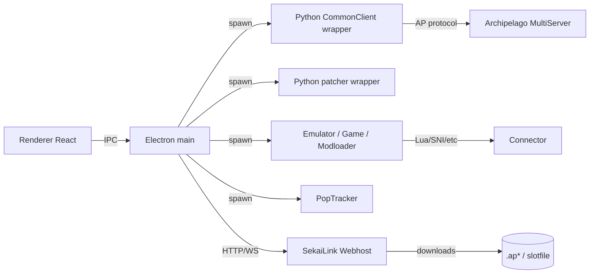

# Architecture cible

Vision: un "Runtime Orchestrator" qui prend un contexte (room, slot, patch URLs, config) et execute un pipeline par jeu.

## Diagramme (haut niveau)

## Components a formaliser

### 1) RuntimeOrchestrator (Electron main)
Responsabilites:
- resoudre quel module runtime utiliser (a partir du patch/game)
- verifier prerequisites (assets, executables, dependances)
- telecharger patch/slotfile
- appliquer patch (si applicable)
- lancer emulateur / jeu (driver)
- lancer trackers
- connecter AP client (CommonClient / SNI / BizHawk / etc)
- supervision processus (crash, relaunch, cleanup)

Code existant partiel:
- `client/app/electron/main.cjs` (patcher/bizhawk/tracker/commonclient)

### 2) Drivers (Electron main)
Objectif: un driver par famille (BizHawk, Dolphin, RetroArch, ModLoader, etc) qui expose un contrat stable.
- le dossier `client/drivers/` existe deja avec des stubs (`BizHawkDriver.ts`, `DolphinDriver.ts`, etc.)

Driver contract propose (pseudo-interface):
- `verify(ctx)` -> {ok, missing[]}
- `prepare(ctx)` -> download/install/patch if needed
- `launch(ctx)` -> pid + handles
- `stop(ctx)`

### 3) Runtime modules (declaratif)
- dossier par jeu: `client/runtime/modules/<moduleId>/`
- `manifest.json` doit devenir la source de verite pour: patch ext(s), driver family, connector (lua/sni/etc), tracker (pack + variants), required assets

### 4) Python services (headless)
- conserver du code Archipelago existant au lieu de reimplementer AP protocol.
- standardiser un protocole IPC JSON (stdin/stdout) pour CommonClient, SNIClient, BizHawkClient, ManualClient, et potentiellement Universal Tracker (mode headless)

### 5) Output/logs
But: "voir ce qui se passe" dans l'app.
- logs client: stream des wrappers Python -> UI
- logs serveur/room: deja via Socket.IO (`terminal_output`)
- logs runtime: orchestrator + drivers

## Linux: Wayland et X11
SekaiLink Desktop doit fonctionner sur:
- session X11 native
- session Wayland native

Approche pragmatique (X11 primaire):
- Electron: activer auto-detection ozone si possible, sans forcer (pour eviter regressions). Exemple: `ELECTRON_OZONE_PLATFORM_HINT=auto` (packaging)
- Emulateurs/outils: beaucoup vont tourner sous XWayland en session Wayland; documenter les prerequis (ex: `mono` pour BizHawk sur Linux)

Note dev (distrobox):
- tester launch de GUI depuis container (DISPLAY / WAYLAND_DISPLAY / XDG_RUNTIME_DIR)
- mais le binaire release tourne sur l'OS host, donc la vraie compat doit etre testee hors container aussi
